# 计算机算法知识及题目解析

####   1.时间复杂度、空间复杂度		最坏情况

#### 2.O(log n)		忽略底数的描述

#### 3.OJ(online judge)		超时时间是1s

$O(n)$	$ 10^8 $  	------>		$O(n^2)$		        $10^4$

求解：$x^2=10^8$

​            $x=10^4$

$O(n)$	$ 10^8 $  	 ------>		$O(nlog(n))$		$10^7$				

求解：$10^x*x=10^8$
						 $x≈7$

#### 4.递归的时间复杂度与空间复杂度

##### 递归的时间复杂度=递归次数*每次递归中的操作次数

#####          递归的空间复杂度=递归深度*每次递归中的空间复杂度

*1）设n为具体数字*
*2）画树形图*

#### 5.数列求和公式

##### 等差数列		$\ S_n = n \cdot a_1 + \frac{n \cdot (n - 1)}{2} \cdot d $

#####           等比数列		$S_n = \frac{{a_1 \cdot (1 - q^n)}}{{1 - q}}$

#### 6.C++内存管理


#### 7.二分法

*前提条件：1)有序 2)无重复元素*

```C++
区间定义：[left,right]
    1)while(left<=right)
    2)right=middle-1;left=middle+1;
	3)middle=left+(right-left)/2;
```

#### 8.$\frac{{a+b}}{2}$	---> 	$a + \frac{{b-a}}{2}$		原因：防止溢出

#### 9.万能库

```c++
#include<bits/stdc++.h>
using namespace std;
int main(){
    return 0;
}
```

#### 10.STL

##### vector	动态数组	<vector>

```c++
初始化:
vector<int> a;
vector<int> a(10);//值不定
vector<int> a(10,1);//值为1
vector<int> a(b.begin(),b.begin()+3);//值为b中第1个到第3个元素
int b[]={1,2,4,5,9,8};
vector<int> a(b,b+6);
vector<int> a={1,2,4,5,9,8};//容器 列表初始化
方法:
a.front();a.back();a[i];
a.clear();
a.erase(a.begin(),a.begin()+3);a.erase(a.begin()+1);//删除第2个元素  //时间复杂度为O(n)
a.pop_back();a.push_back(5);//时间复杂度为O(1)
a.insert(a.begin()+1,5);a.insert(a.begin(),3,5);a.insert(a.begin()+1,b+3,b+6);a.insert(a.begin()+1,b.begin()+3,b.begin()+6);//时间复杂度为O(n)
a.size();
a.resize(10);a.resize(10,2);
a==b;a>=b;a<=b;a!=b;a<b;a>b;
```

##### deque	双端数组	<deque>	与vector相比

```c++
a.pop_front();//时间复杂度为O(1)
a.push_front();//时间复杂度为O(1)
```

##### list	双向链表	<list>	与vector相比

```c++
a.pop_front();//时间复杂度为O(1)
a.push_front();//时间复杂度为O(1)
```

##### string	字符串	<string>	与vector相比

```c++
初始化:
string str;
string str(10,'A');
string str="ABC";
方法:
str.resize(10);str.resize(10,'C');
str.push_back('A');str.append("ABC");str+='A';str+="ABC";//时间复杂度为O(1)
str.insert(2,3,'A');str.insert(2,"ABC");str.insert(str.begin()+2,'A');str.insert(str.begin()+2,3,'A');str.insert(str.begin()+1,str2.begin()+3,str2.begin()+6);
str.erase(2);str.erase(2,1);// 删除从位置 2 开始的 1 个字符
str.erase(str.begin()+2);str.erase(str.begin(),str.begin()+3);
str.find('A');str.find("ABC");//返回子串的首字符位置，或若找不到这种子串则为 std::string::npos
str.substr(2);//提取从位置 2 开始，到字符串末尾的子字符串
str.substr(2,3);//提取从位置 2 开始，长度为 3 的子字符串
a==b;a>=b;a<=b;a!=b;a<b;a>b;//会先按照字典序比较字符串的字符，只有在字符相等的情况下才会考虑字符串的长度
```

##### queue	队列	<queue>	容器适配器

```c++
a.push(x);
a.pop();
a.front();
a.back();
```

##### stack	栈	<stack>	容器适配器

```c++
a.push(x);
a.pop();
a.top();
```

##### set	集合	<set>	升序

```c++
初始化:
set<int> a;//默认升序
set<int,less<int>> a;//升序
set<int,greater<int>> a;//降序
方法:
a.insert(x);
a.erase(a.begin(),a.begin()+3);a.erase(x);a.erase(a.begin()+1);//删除第二个元素
a.find(x);
a.begin();
a.end();
```

##### map	哈希	<map>	升序	

```c++
初始化:
map<int,string> list1;//默认升序
map<int,string,less<int>> list1;//升序
map<int,string,greater<int>> list1;//降序
map<int,string> list2 = {{1,"java教程"},{2，"c++教程"},{3,"python教程"}}；
map<int,string> list3 = {pair<int,string> (1,"java教程"),pair<int,string> (2,"c++教程")};
方法:
list1.insert(pair<int,int> (1,15));list1.insert({1,15});
a.erase(a.begin(),a.begin()+3);a.erase(1);a.erase(a.begin()+1);//删除第二个元素
a[1]=6;//如果键 1 不存在，map 容器会自动插入一个新的键值对
a.find(1);
a.begin();
a.end();
```

##### priority_queue	优先队列	<queue>	大顶堆

```c++
初始化:
priority_queue<int> a;//默认大顶堆
priority_queue<int,vector<int>,less<int>>	a;//大顶堆
priority_queue<int,vector<int>,greater<int>>	a;//小顶堆
方法:
a.push(x);//O(log(n))
a.pop();//O(log(n))
a.top();
```

扩展:

1.统计最大前k个元素:k个元素的小顶堆(**只有小顶堆每次将最小的元素弹出，最后小顶堆里积累的才是前k个最大元素**)

##### multimap	哈希	<map>	升序

```c++
方法:
a.count(key);
list1.insert(pair<int,int> (1,15));list1.insert({1,15});
a.erase(a.begin(),a.begin()+3);a.erase(x);//删除键为x的所有元素 
a.erase(a.begin()+1);//删除第二个元素
//和map容器相比，multimap未提供at()成员方法，也没有重载[ ] 运算符
a.find(1);//若存在多个具有相同键的元素，只返回第一个匹配的元素
a.begin();
a.end();
a.equal_range(x);//查找键为 x 的元素范围,返回一个迭代器的pair对象，first成员等价于lower_bound(key)//返回一个迭代器，指向键>=k的第一个元素，second成员等价于upper_bound(key)//返回一个迭代器，指向键>k的第一个元素//lower_bound与upper_bound在有序容器如set、map、multiset、multimap使用
	auto range = a.equal_range(1);
	// 遍历范围内的元素
    for (auto it = range.first; it != range.second; ++it) {
         cout << it->first << ": " << it->second << endl;
    }
```

##### multiset	集合	<set>	升序

```c++
方法:
a.count(x);
a.insert(x);
a.erase(a.begin(),a.begin()+3);a.erase(x);a.erase(a.begin()+1);//删除第二个元素
a.find(x);
a.begin();
a.end();
a.equal_range(x);
```

##### pair

```c++
pair<string,int> p={"hello",1};
pair<string,int> p("hello",1);
pair<string,int> p = make_pair("hello",1);

p.first; //第一个元素 =hello
p.second; //第二个元素 = 1

//套娃操作 用pair存储3个数据
pair<int, pair<int, int>> p(1,{2,3});

当pair 结合 sort()函数使用的时候， pair 默认对first升序，当first相同时对second升序（从小到大）。 也可以通过修改cmp函数达到对second排序    
```

##### 迭代器

迭代器实质上是一个指针，但是，并不是所有的容器的迭代器可以支持加减操作。

```c++
能进行算术运算的迭代器只有随机访问迭代器，要求容器元素存储在连续内存空间内;
即vector、string、deque的迭代器是有加减法的；  
而map、set、multimap、multiset、list的迭代器是没有加减法的。他们仅支持++itr、–itr这些操作。
```

advance函数：将迭代器移动指定的距离

可以用于多种容器，包括 `std::vector`, `std::list`, `std::deque` 等。对于支持随机访问的容器（如 `std::vector`），`std::advance` 可以直接通过加法操作来移动迭代器。对于不支持随机访问的容器（如 `std::list`），`std::advance` 会通过多次递增或递减操作来达到目标位置。

```c++
vector<int> vec = {1, 2, 3, 4, 5};
auto it = vec.begin();
// 向前移动迭代器 2 位
advance(it, 2);
// 向后移动迭代器 1 位
advance(it, -1);
```

#### 11.自定义排序（后面深入模版再查看原因）

const成员函数：const实际修饰该成员函数隐含的**this指针**，**表明在该成员函数中不能对类的任何成员进行修改** 

##### set：

```c++
//创建castle类
class Castle
{
public:
	Castle(string name, int area)  //提供有参构造函数
	{
		this->m_Name = name;
		this->m_Area = area;
	}
	string m_Name;  //建筑名称
	int m_Area;  //建筑面积
};

struct Castle
{
	Castle(string name, int area) :m_Name(name), m_Area(area) {}

	string m_Name;  //建筑名称
	int m_Area;  //建筑面积
};
//创建降序仿函数（类）
class MyCustom
{
public:
	//重载小括号()
	bool operator()(const Castle& c1, const Castle& c2) const   //注意后面加个const，否则报错  
	{
		if (c1.m_Name != c2.m_Name)
			return c1.m_Name > c2.m_Name;
		else 
			return c1.m_Area > c2.m_Area;   //按建筑面积降序排序
	}
};
    
//在C++中，结构体是特殊的类。
//和类的唯一区别：具有不同的默认访问控制属性。类中默认private,结构体默认public。
//C++为为C语言中的结构体引入了成员函数、访问控制权限、继承、多态等面向对象特性。
struct MyCustom
{
	//重载小括号()
	bool operator()(const Castle& c1, const Castle& c2) const   //注意后面加个const，否则报错 原因：set容器STL内部调用实参为const Date*
	{
		if (c1.m_Name != c2.m_Name)
			return c1.m_Name > c2.m_Name;
		else 
			return c1.m_Area > c2.m_Area;   //按建筑面积降序排序
	}
};


//利用列表初始化，创建对象
Castle c1 = { "餐厅", 235 };
//利用有参构造函数，创建对象
Castle c2("客厅", 666);
//创建set容器，注意尖括号里面的内容，说明创建的是Castle类对象，同时按指定的方法排序
set<Castle, MyCustom> ss;
```
##### sort()：

```c++
//创建castle类
class Castle
{
public:
	Castle(string name, int area)  //提供有参构造函数
	{
		this->m_Name = name;
		this->m_Area = area;
	}
	string m_Name;  //建筑名称
	int m_Area;  //建筑面积
};

struct Castle
{
	Castle(string name, int area) :m_Name(name), m_Area(area) {}

	string m_Name;  //建筑名称
	int m_Area;  //建筑面积
};

//创建降序仿函数（类）
class MyCustom
{
public:
	//重载小括号()
	bool operator()(const Castle& c1, const Castle& c2) const   //注意后面加个const，否则报错  
	{
		if (c1.m_Name != c2.m_Name)
			return c1.m_Name > c2.m_Name;
		else 
			return c1.m_Area > c2.m_Area;   //按建筑面积降序排序
	}
};
    
//在C++中，结构体是特殊的类。
//和类的唯一区别：具有不同的默认访问控制属性。类中默认private,结构体默认public。
//C++为为C语言中的结构体引入了成员函数、访问控制权限、继承、多态等面向对象特性。
struct MyCustom
{
	//重载小括号()
	bool operator()(const Castle& c1, const Castle& c2) const   //注意后面加个const，否则报错 原因：set容器STL内部调用实参为const Date*, 而
	{
		if (c1.m_Name != c2.m_Name)
			return c1.m_Name > c2.m_Name;
		else 
			return c1.m_Area > c2.m_Area;   //按建筑面积降序排序
	}
};

static bool cmp(const Castle& c1, const Castle& c2) {
	if (c1.m_Name != c2.m_Name)
		return c1.m_Name > c2.m_Name;
	else
		return c1.m_Area > c2.m_Area;   //按建筑面积降序排序
}


vector<Castle> ss;
//sort函数的第三个参数可以是函数对象(重载函数调用操作符（operator()）来实现可调用操作的类的对象)
MyCustom mycustom;
sort(ss.begin(), ss.end(), mycustom);
//sort函数的第三个参数可以是函数指针（函数名也是函数地址）
sort(ss.begin(), ss.end(), cmp);
```

#### 12.this指针

```c++
class Date
{
public:
	//Print编译器处理前
	void Print()
	{
		cout << _year << "-" << _month << "-" << _day << endl;
	}
 
	//Print编译器处理后
	void Print(Data* const this) //注意const修饰，指针不能修改，指向的内容可以修改
	{
		cout << this->_year << "-" << this->_month << "-" << this > _day << endl;
	}
 
	//Init编译器处理前
	void Init(int year, int month, int day)
	{
		_year = year;
		_month = month;
		_day = day;
	}
	//Init编译器处理后
	void Init(Date* const this, int year, int month, int day)
	{
		this->_year = year;
		this->_month = month;
		this->_day = day;
	}
private:
	int _year; // 年
	int _month; // 月
	int _day; // 日
};
int main()
{
	Date d1;
	Date d2;
	Date d3;
	d1.Init(2022, 10, 17);
	d2.Init(2023, 10, 18);
 
	//编译器实参改变
	d1.Init(&d1, 2022, 10, 17);
	d2.Init(&d2, 2023, 10, 18);
 
	d1.Print();
	d2.Print();
 
	//编译器实参改变
	d1.Print(&d1);
	d2.Print(&d2);
 
	return 0;
}
```

#### 13.const修饰

```c++
1）const修饰变量:
const char *p = "hello";  // 非const指针,
                           // const数据
						  // 可以指向别的变量，但不可以通过修改所指向的变量的值

char * const p = "hello";   // const指针,
                            // 非const数据
							// 可以修改所指向变量的值,但不可以指向别的变量

const char * const p = "hello";  // const指针,
                                 // const数据
								 // 不可以修改所指向变量的值,也不可以指向别的变量
技巧:
const往右看，忽视数据类型，p代表指针内容不可改变，*p代表指针所指向的内容不可改变
2）const修饰函数:
const char* func();//函数声明
char* str = func();// error 
const char* str = func(); //right
```

##### 权限问题：——涉及指针或引用时，而普通变量之间主要是赋值关系。

*权限不能放大(松），只能缩小(紧)或不变。*

```c++
class Date
{
public:
	//构造函数
	Date(int year, int month, int day)
	{
		_year = year;
		_month = month;
		_day = day;
	}
	void Printf()
	{
		cout << _year << "年" << _mon th << "月" << _day << "日" << endl;
	}
private:
	int _year;
	int _month;
	int _day;
};
 
void Func(const Date& d)
{
	d.Printf();
}
 
int main()
{
	Date d1(2023, 11, 1);
	d1.Printf();
	Date d2(2023, 11, 2);
	Func(d2);//error
	return 0;
}
```


#### 14.algorithm

##### sort函数		默认升序

```c++
1)数组
int arr[]={3,1,4,1,5,9,2,6,5,3,5};
int n=sizeof(arr)/sizeof(int);
sort(arr,arr+n);
2)vector容器  
vector<int> arr={3,1,4,1,5,9,2,6,5,3,5};
sort(arr.begin(),arr.end());
```

##### reverse函数		仅适用于容器，不适用于数组

```c++
vector<int> arr={3,1,4,1,5,9,2,6,5,3,5};
reverse(arr.begin(),arr.end());
```

"整体反转+局部反转"法

##### swap函数		

```c++
1)数组
int arr[]={3,1,4,1,5,9,2,6,5,3,5};
swap(arr[i],arr[j]);
2)vector容器
vector<int> arr={3,1,4,1,5,9,2,6,5,3,5};
swap(arr[i],arr[j]);
3)变量
swap(a,b);
```

##### find函数

```c++
1)数组
int arr[]={1,3,5,7,9};
int n=sizeof(arr)/sizeof(int);
int* p=find(arr,arr+n,5);
p!=arr+n
2)vector容器
vector<int> vec={1,3,5,7,9};
auto iter=find(vec.begin(),vec.end(),5);
iter!=vec.end();
```

##### cmath

```c++
fabs(double x);//绝对值
floor(double x);//向下取整		
ceil(double x);//向上取整
log(double x);//以e为底的对数
sin(double x);cos(double x);tan(double x);//参数为弧度
asin(double x);acos(double x);atan(double x);//返回的结果是以弧度为单位的角度值
round(double x);//四舍五入仅保留到整数位，保留小数位可先乘再除
__gcd(a,b);//最大公因数
a*b/__gcd(a,b);//最小公倍数
```

##### 常量

```c++
const double PI=atan(1.0)*4;//精确的PI值
const int INF=(1<<30)-1;//避免大数+大数溢出
```

##### 字符串与char* 字符指针、数字的相互转化

```c++
1)字符串转化字符指针
str.c_str();
2)字符指针转化数字
atoi(char_p);
atol(char_p);
atof(char_p);    
3)字符串转化数字
stoi(str);
stol(str);
stoll(str);
stof(str);  
stod(str);
stoll(str, nullptr, 2);//将二进制字符串转换为长长整型
4)数字转化字符串
to_string(num);
5)字符指针转化字符串
char* charPtr = "Hello, World!";
string str(charPtr);
string str;
str = charPtr;
```

##### 全排列

```c++
1)vector
do{
    
}
while(next_permutation(nums.begin(),nums.end()));
2)数组
do{
    
}
while(next_permutation(arr,arr+n));
3)字符串
do{
    
}
while(next_permutation(str.begin(),str.end()));
```

##### printf函数

```c++
1)%md 	变量超过m位则保持原样输出
2)输出string类型
string s = "Hello World";
printf("%s", s.c_str()); 
3)格式
%[标志][最小宽度][.精度][类型长度]类型。
d o(不输出前缀0) u x/X(不输出前缀0x) f/lf  e/E  c s p 
- 左对齐 +输出符号 space 为正空格为负负号 0 前面为0
```

##### scanf函数

```c++
1)除了%c，scanf函数对%d,%s等其他格式把空白符和换行符视为结束
2)多行字符串输入
    2
    Apple is red.
    Banana is yellow.
    
    方法一：
    scanf("%d",&a);//cin>>a;
	getchar();
	getline(cin,s1);//以换行符结束
	getline(cin,s2);

	方法二：
	scanf("%d\n",&a);
    getline(cin,s1);
	getline(cin,s2);
3)读取到文件结尾(Window系统Dos平台Ctrl+Z代表文件结束符)
    while(scanf("%d",&n)!=EOF){
        ...
    }
```

##### sizeof函数

```c++
sizeof(arr);//数组大小
sizeof(str);//字符串对象大小  通常包含多个成员变量即不是简单的个数乘以类型字节数
sizeof(vec);//vector对象大小 通常包含多个成员变量即不是简单的个数乘以类型字节数
```

##### 数据结构定义

```c++
链表
    struct ListNode{
        int val;
        ListNode* next;
        ListNode(int x):val(x),next(NULL){}
    };
二叉树
    struct TreeNode{
        int val;
        TreeNode* left;
        TreeNode* right;
        TreeNode(int x):val(x),left(NULL),right(NULL){}
    }; 
```

##### lower_bound与upper_bound函数——时间复杂度$O(log(n))$，内部实现基于二分查找

```c++
lower_bound//用于在有序容器查找第一个大于或等于给定值的元素位置。如果没有找到，它将返回指向容器末尾的迭代器（或指针）。左闭右开区间 不要求不重复
upper_bound//用于在有序容器查找第一个大于给定值的元素位置。如果没有找到，它将返回指向容器末尾的迭代器（或指针）。左闭右开区间不要求不重复

1)数组
int arr[] = {10, 20, 30, 40, 50};
int size = sizeof(arr)/sizeof(int);
auto lowerIt = lower_bound(arr, arr + size, 30);
if (lowerIt != arr + size) {
	cout << "找到元素：" << *lowerIt << endl;
} else {
	cout << "未找到元素" << endl;
}
2)vector容器  
vector<int> vec = {10, 20, 30, 40, 50};
auto lowerIt = lower_bound(vec.begin(), vec.end(), 30);
if (lowerIt != vec.end()) {
	cout << "找到元素：" << *lowerIt << endl;
} else {
	cout << "未找到元素" << endl;
}
```

#### 15.数组

```c++
1)数组传参:
一维数组：
	void test(int arr[]);
	void test(int arr[10]);
二维数组:
	void test(int arr[][5]);
	void test(int arr[3][5]);
2)赋值
局部变量一维数组、二维数组={0},其他元素默认赋值为0。
3)字符串 
string s[11];//字符串数组可以像二维数组那样访问
```

#### 16.列表初始化和构造函数传参

1)容器可初始化列表

```c++
string hex_16[16]={"0000","0001","0010","0011","0100","0101","0110","0111","1000","1001","1010","1011","1100","1101","1110","1111"};
```

2)new

```c++
Rectangle* p_rect=new Rectangle{5.0,6.0};//列表初始化
Rectangle* p_rect=new Rectangle(5.0,6.0);//有参构造函数
Rectangle* p_rect=new Rectangle;//无参构造函数

delete p_rect;
```

####   17.常识

1)1不是质数也不是合数。

2)1和任何数互质，其他情况下最大公因数为1就互质。

3)闰年要么可被4整除，但不可被100整除；要么可被400整除。

4)真因子:除了它本身以外的因子，包括1在内。

5)完全平方数:一个能表示成某个整数的平方的形式的数。

6)*VS快速弹出智能提示*：Ctrl+J。

7)32位系统下基本数据类型规模

```c++
类型					   规模        输出格式符
int/long				10^9		%d
long long				10^18		%lld
unsigned long long		10^20		%llu
float								%f
double								%lf
```

8)蓝桥杯最大栈空间为256MB，即最大可以开10^7左右的数组空间。

9)set与vetor的相互转化

```c++
vector转set:
vector<int> nums1;
unordered_set<int> nums_set(nums1.begin(), nums1.end());

set转vector:
unordered_set<int> nums2;
vector<int> nums_vector(nums2.begin(), nums2.end());
```

10)验算：

```c++
输入规模的最小项、最大项；
输入规模的奇偶项;
输入值的负数、输入值的零；
输入值的无规律排列；
根据输入规模最大值决定是否开拓新空间；
```

11)排序算法时间复杂度

冒泡排序：$O(n^2)$

快速排序：$O(n*log(n))$  

12)进阶时间复杂度计算

***看每一个元素被操作的次数，每个元素在滑动窗口进来操作一次，出去操作一次，每个元素都是被操作两次，所以时间复杂度是 $2 × n $也就是$O(n)$***

```c++
class Solution {
public:
    int minSubArrayLen(int s, vector<int>& nums) {
        int result = INT32_MAX;
        int sum = 0; // 滑动窗口数值之和
        int i = 0; // 滑动窗口起始位置
        int subLength = 0; // 滑动窗口的长度
        for (int j = 0; j < nums.size(); j++) {
            sum += nums[j];
            // 注意这里使用while，每次更新 i（起始位置），并不断比较子序列是否符合条件
            while (sum >= s) {
                subLength = (j - i + 1); // 取子序列的长度
                result = result < subLength ? result : subLength;
                sum -= nums[i++]; // 这里体现出滑动窗口的精髓之处，不断变更i（子序列的起始位置）
            }
        }
        // 如果result没有被赋值的话，就返回0，说明没有符合条件的子序列
        return result == INT32_MAX ? 0 : result;
    }
};
```

13)二维动态数组的定义与赋值

```c++
vector<vector<int>> res(n, vector<int>(n, 0)); // 使用vector定义一个二维数组
res[i][j];
```

14)数组与链表的特性对比


15)单链表统一所有节点的删除操作和增加操作——***设置一个虚拟头结点***

```c++
head = dummyNode->next;
```


16）C++11基于范围的for循环——可以遍历支持迭代器的集合，如std::vector、std::list等，也可以遍历支持下标操作的集合，如std::array和普通数组

```c++
//for-range-declaration是一个迭代变量，用于表示每一次迭代中从for-range-initializer中获取的元素的值或引用，for-range-initializer是一个表示容器或数组的表达式。
for (for-range-declaration : for-range-initializer) {
    // 循环体
}

16.1 auto
    16.1.1 auto 类型——迭代变量只是集合中数据元素的拷贝
    vector<int> v{1,2,3,4,5};
    for(auto i : v) {
        i++;
        cout << i << " "; // 输出2 3 4 5 6
    }
    for(vector<int>::iterator it = v.begin(); it != v.end(); it++){
        cout << *it << " "; // 输出1 2 3 4 5
    }
    16.1.2 auto &类型——迭代变量是一个非常量左值引用，它是集合中数据元素的引用，如果对迭代变量进行修改，会直接影响到集合数据元素本身
    vector<int> v{1,2,3,4,5};
    for(auto& i : v) {
        i++;
        cout << i << " "; // 输出2 3 4 5 6
    }
    for(vector<int>::iterator it = v.begin(); it != v.end(); it++){
        cout << *it << " "; // 输出2 3 4 5 6
    }
    16.1.3 const auto&类型——迭代变量是集合中数据元素的引用，但是它是只读的不能被修改
    vector<int> v{1,2,3,4,5};
    for(const auto& i : v) {
        i++;              // 编译出错
        cout << i << " ";
    } 
16.2 map
	map<int, string>m1 = { {1,"naruto"},{2,"sakura"},{3,"luffy"} };
	for (auto it : m1)
	{
		std::cout << "first:" << it.first << " second:" << it.second << endl;
	}
16.3 数组
    int arr[] = {1, 2, 3, 4, 5};
    for (auto element : arr) {
       cout << element << " ";
    }
```

17)类型转换


18)异或操作的性质

```C++
1.异或操作满足交换律和结合律，即 a ^ b = b ^ a 、 (a ^ b) ^ c = a ^ (b ^ c)。
2.对于任意数 a，a ^ a = 0，a ^ 0 = a。//仅对整数成立
3.x1^x2=0 <==> x1=x2
```

19)表示整数大小的常量

#include <limits.h> 	定义了一些表示整型大小的常量

| 宏         | 备注                        |
| :--------- | :-------------------------- |
| CHAR_BIT   | char 类型的位数             |
| CHAR_MAX   | char 类型的最大值           |
| CHAR_MIN   | char 类型的最小值           |
| INT_MAX    | int 类型的最大值            |
| INT_MIN    | int 类型的最小值            |
| LONG_MAX   | long 类型的最大值           |
| LONG_MIN   | long 类型的最小值           |
| SCHAR_MAX  | signed char 类型的最大值    |
| SCHAR_MIN  | signed char 类型的最小值    |
| SHRT_MAX   | short  类型的最大值         |
| SHRT_MIN   | short 类型的最小值          |
| UCHAR_MAX  | unsigned char 类型的最大值  |
| UINT_MAX   | unsigned int 类型的最大值   |
| ULONG_MAX  | unsigned long 类型的最大值  |
| USHORT_MAX | unsigned short 类型的最大值 |

20)组合

```c++
int combination(int n,int m){
    if(n<m) return 0;
    if(m>n-m) m=n-m;
    int res=1;
    for(int i=0;i<m;i++){
        int Numerator=n-i;//分子
        int Denominator=i+1;//分母
        res*=Numerator;
        res/=Denominator;
    }
    return res;
}
```

21)将乘法运算和除法运算替换为位移运算可以提高代码的执行效率，仅适用于整数类型。

```c++
int m=n*2可改为 m=n<<1;
int m=n/16可改为 m=n>>4;
```

22)

```c++
n*(n+1)/2改成n*(n+1)*0.5更好点，这样前者是截断，后者是隐式类型转换成double。
```

23)判断质数

```c++
bool isPrime(int n){
    for (int i=2; i<=(int)sqrt(n); i++ ){//如果n被i整除，则返回false
        if(n%i==0){
            return false;
        }
    }
    return true;    // 反之则返回true 
}
```

24)读取文本文件并按行读取字符串到 `string`

```c++
ifstream fileStream;
string hang;
vector<string> input;
fileStream.open("main.txt", ios::in); // ios::in 表示以只读的方式读取文件

if (fileStream.is_open()) {
    while (getline(fileStream, hang)) {
        input.push_back(hang);
        cout << hang << endl;
    }
    fileStream.close();
    cout << input.size();
} else {
    cout << "无法打开文件" << endl;
}
```

25)将数据写入文本文件

```c++
ofstream fileStream;  // 创建 ofstream 对象
fileStream.open("main.txt", ios::out);  // 打开文件 main.txt，使用输出模式（ios::out）	ios::app：追加模式，用于在文件末尾追加数据而不是覆盖原有内容。  ios::in | ios::out 同时将文件流设置为输入模式和输出模式

if (fileStream.is_open()) {  // 检查文件是否成功打开  
    for (int i = 2; i <= 1E8; i++) {
        if (isPrime(i)) {
            fileStream << i << ",";  // 将输出写入文件
        }
    }

    fileStream.close();  // 关闭文件
}
else {
    cout << "无法打开文件" << endl;
}
```

26)输入数据多组

```c++
//C++
#include <iostream>
using namespace std;

int main() {
    int a, b;
    while (cin >> a >> b) { // 注意 while 处理多个 case  输入结束或者遇到无效的输入时，循环将退出。
        cout << a + b << endl;
    }
}

//C
#include <stdio.h>
int main() {
    int a, b;
    while (scanf("%d %d", &a, &b) != EOF) { // 注意 while 处理多个 case
        printf("%d\n", a + b);
    }
    return 0;
}
```

27)输入数据有多组, 每行表示一组输入数据。每行不定有n个整数，空格隔开。

```c++
long long n,sum;
vector<long long> input;

int main() {
    string line;
    while (getline(cin, line)) {
        sum=0;
        istringstream iss(line);
        int num;
        while (iss >> num) {
            sum+=num;
        }
        cout << sum<<endl;
    }
    return 0;
}
```

28)输入数据有多组, 每行表示一组输入数据。每行不定有n个整数，逗号隔开。

```c++
int main() {
    string line;
    while (getline(cin, line)) {
        long long sum = 0;
        istringstream iss(line);
        string token;
        while (getline(iss, token, ',')) {
            long long num = stoll(token);  // 将分割得到的字符串转换为长整数
            sum += num;
        }
        cout << sum << endl;
    }
    return 0;
}
```

29)double pow( double base, double exponent )在exponent为负数也能计算。

30)

#### 18.双指针法(快慢指针法)

一个for循环完成两个for循环的工作$(O(n)$到$O(n^2)$)	在数组、链表、字符串很常见

***前提：定义fastIndex与slowIndex***

扩展：

1.滑动区间：slowIndex代表起始位置，fastIndex代表结束位置。

2.三数之和及以上：双指针用一个for循环替代两个for循环。

**[ LeetCode：15.三数之和](https://www.programmercarl.com/0015.%E4%B8%89%E6%95%B0%E4%B9%8B%E5%92%8C.html)**


```c++
result.push_back(vector<int>{nums[i], nums[left], nums[right]});
while (right > left && nums[right] == nums[right - 1]) right--;
while (right > left && nums[left] == nums[left + 1]) left++;
right--;// 找到答案时，双指针同时收缩
left++;

//三数之和细节问题
if (i > 0 && nums[i] == nums[i - 1]) {
    continue;
}
//四数之和细节问题
if (i > 0 && nums[i] == nums[i - 1]) {
    continue;
}
if (i > k + 1 && nums[i] == nums[i - 1]) {
	continue;
}
```

3.数组填充类:预先给数组扩容带填充后的大小，再从后向前进行操作。

#### 19.关于链表的数学

1)链表相交


***2)环形链表||***

***2.1 判断链表是否有环——快慢指针法***

分别定义 fast 和 slow 指针，从头结点出发，fast指针每次移动两个节点，slow指针每次移动一个节点，如果 fast 和 slow指针在途中相遇 ，说明这个链表有环。


***2.2  如果有环，如何找到这个环的入口***


#### 20.哈希法:***数组、set、map***。

***数组：***26个英文字母表等限制数值大小情况

***set：***

***map：***


#### 21.KMP算法——快速查找匹配串

主要思想：当出现字符串不匹配时，可以知道一部分之前已经匹配的文本内容，可以利用这些信息避免从头再去做匹配了。

时间复杂度从$O(m \times n)$到$O(m + n)$

 


预处理出 `next` 数组，数组中每个位置的值就是该下标应该跳转的***目标位置***（ `next` 点），时间复杂度是$O(m) $。


```c++
void getNext(int* next, const string& s) {
        int j = 0;
        next[0] = 0;
        for(int i = 1; i < s.size(); i++) {
            while (j > 0 && s[i] != s[j]) { // j要保证大于0，因为下面有取j-1作为数组下标的操作
                j = next[j - 1]; // 注意这里，是要找前一位的对应的回退位置了
            }
            if (s[i] == s[j]) {
                j++;
            }
            next[i] = j;
        }
}
int strStr(string haystack, string needle) {
        if (needle.size() == 0) {
            return 0;
        }
        int next[needle.size()];
        getNext(next, needle);
        int j = 0;
        for (int i = 0; i < haystack.size(); i++) {// 注意i就从0开始
            while(j > 0 && haystack[i] != needle[j]) {// 不匹配
                j = next[j - 1];// j 寻找之前匹配的位置
            }
            if (haystack[i] == needle[j]) {// 匹配，j和i同时向后移动
                j++;// i的增加在for循环里
            }
            if (j == needle.size() ) {// 文本串s里出现了模式串t
                return (i - needle.size() + 1);
            }
        }
        return -1;
}
```

***C++中string容器的find函数不使用KMP算法，而是使用内部优化的朴素匹配算法。***

扩展：

1.判断字符串是否由重复子串组成：字符串长度能被最小重复子串长度整除则是。


#### 22.**栈与递归之间在某种程度上是可以转换的！**（但是有的场景难度可能比较大，例如：**都知道回溯法其实就是递归，但是很少人用迭代的方式去实现回溯算法！)**

#### 23.单调队列

***滑动窗口的最大值或最小值问题：***

```c++
a.push(x);
a.pop(y);
a.front();//返回最大值或最小值
```

实现方式:***multiset、单调队列(自己定义)、***优先队列(以(数据，下标)为元素)

```c++
//时间复杂度 O(n)
class MyQueue { //单调队列（从大到小）
public:
    deque<int> que; // 使用deque来实现单调队列
    // 每次弹出的时候，比较当前要弹出的数值是否等于队列出口元素的数值，如果相等则弹出。
    // 同时pop之前判断队列当前是否为空。
    void pop(int value) {
        if (!que.empty() && value == que.front()) {
            que.pop_front();
        }
    }
    // 如果push的数值大于入口元素的数值，那么就将队列后端的数值弹出，直到push的数值小于等于队列入口元素的数值为止。
    // 这样就保持了队列里的数值是单调从大到小的了。
    void push(int value) {
        while (!que.empty() && value > que.back()) {
            que.pop_back();
        }
        que.push_back(value);
    }
    // 查询当前队列里的最大值 直接返回队列前端也就是front就可以了。
    int front() {
        return que.front();
    }
};
```


```c++
//时间复杂度 O(nlog(n))
vector<int> maxSlidingWindow(vector<int>& nums, int k) {
    int n = nums.size();
    priority_queue<pair<int, int>> q;//排序方式是按照 pair 的第一个元素进行降序排序
    
    // 初始化滑动窗口，将前k个元素插入优先队列中
    for (int i = 0; i < k; ++i) {
        q.push(pair<int,int>{nums[i], i});
    }
    
    // 存储每个滑动窗口的最大值
    vector<int> ans = {q.top().first};
    
    // 遍历剩余元素，更新滑动窗口的最大值
    for (int i = k; i < n; ++i) {
        q.push(pair<int,int>{nums[i], i});
        
        // 移除超出滑动窗口范围的元素
        while (q.top().second <= i - k) {
            q.pop();
        }
        
        // 将当前滑动窗口的最大值加入结果列表
        ans.push_back(q.top().first);
    }
    
    return ans;
}
```

```c++
//时间复杂度 O(nlog(k))
class Solution {
public:
    vector<int> maxSlidingWindow(vector<int>& nums, int k) {
        multiset<int> st;  // 用于存储滑动窗口中的元素，按非递减顺序排序
        vector<int> ans;   // 存储每个滑动窗口的最大值

        for (int i = 0; i < nums.size(); i++) {
            if (i >= k) {
                // 如果窗口大小超过 k，移除窗口最左边的元素
                st.erase(st.find(nums[i - k]));
            }

            // 将当前元素插入到窗口中
            st.insert(nums[i]);

            if (i >= k - 1) {
                // 当形成一个完整的窗口时，将窗口中的最大值加入结果列表
                ans.push_back(*st.rbegin());
            }
        }

        return ans;
    }
};
```

#### 24.二叉树

##### 24.1二叉树的种类

1.满二叉树


2.完全二叉树


3.二叉搜索树——右子树>根节点>左子树


4.平衡二叉搜索树——在二叉搜索树的基础上，它是一棵空树或者它的左右两个子树的高度差的绝对值不超过1


##### 24.2二叉树的存储方式


如果父节点的数组下标是 i，那么它的左孩子就是 i \* 2 + 1，右孩子就是 i \* 2 + 2。

##### 24.3二叉树的遍历方式

1.深度优先遍历——递归法和迭代法(栈)

1.1前序遍历

```c++
//递归法
void traversal(TreeNode* cur, vector<int>& vec) {
	if (cur == NULL) return;
	vec.push_back(cur->val);    // 中
	traversal(cur->left, vec);  // 左
	traversal(cur->right, vec); // 右
}

//迭代法
//保证出栈的时候是根左右的顺序
class Solution {
public:
    vector<int> preorderTraversal(TreeNode* root) {
        stack<TreeNode*> st;
        vector<int> result;
        if (root == NULL) return result;
        st.push(root);
        while (!st.empty()) {
            TreeNode* node = st.top();                       // 中
            st.pop();
            result.push_back(node->val);
            if (node->right) st.push(node->right);           // 右（空节点不入栈）
            if (node->left) st.push(node->left);             // 左（空节点不入栈）
        }
        return result;
    }
};

//统一迭代法
//将访问的节点放入栈中，把要处理的节点放入栈之后，紧接着放入一个空指针作为标记
class Solution {
public:
    vector<int> preorderTraversal(TreeNode* root) {
        vector<int> result;
        stack<TreeNode*> st;
        if (root != NULL) st.push(root);
        while (!st.empty()) {
            TreeNode* node = st.top();
            if (node != NULL) {
                st.pop();
                if (node->right) st.push(node->right);  // 右
                if (node->left) st.push(node->left);    // 左
                st.push(node);                          // 中
                st.push(NULL);
            } else {
                st.pop();
                node = st.top();
                st.pop();
                result.push_back(node->val);
            }
        }
        return result;
    }
};
```

1.2中序遍历

```c++
//递归法
void traversal(TreeNode* cur, vector<int>& vec) {
    if (cur == NULL) return;
    traversal(cur->left, vec);  // 左
    vec.push_back(cur->val);    // 中
    traversal(cur->right, vec); // 右
}

//迭代法
//针对处理顺序和访问顺序(遍历顺序)不一致，借用指针的遍历来帮助访问节点，栈则用来处理节点上的元素 
class Solution {
public:
    vector<int> inorderTraversal(TreeNode* root) {
        vector<int> result;
        stack<TreeNode*> st;
        TreeNode* cur = root;
        while (cur != NULL || !st.empty()) {
            if (cur != NULL) { // 指针来访问节点，访问到最底层
                st.push(cur); // 将访问的节点放进栈
                cur = cur->left;                // 左
            } else {
                cur = st.top(); // 从栈里弹出的数据，就是要处理的数据（放进result数组里的数据）
                st.pop();
                result.push_back(cur->val);     // 中
                cur = cur->right;               // 右
            }
        }
        return result;
    }
};

//统一迭代法
//将访问的节点放入栈中，把要处理的节点放入栈之后，紧接着放入一个空指针作为标记
class Solution {
public:
    vector<int> inorderTraversal(TreeNode* root) {
        vector<int> result;
        stack<TreeNode*> st;
        if (root != NULL) st.push(root);
        while (!st.empty()) {
            TreeNode* node = st.top();
            if (node != NULL) {
                st.pop(); // 将该节点弹出，避免重复操作，下面再将右中左节点添加到栈中
                if (node->right) st.push(node->right);  // 添加右节点（空节点不入栈）

                st.push(node);                          // 添加中节点
                st.push(NULL); // 中节点访问过，但是还没有处理，加入空节点做为标记。

                if (node->left) st.push(node->left);    // 添加左节点（空节点不入栈）
            } else { // 只有遇到空节点的时候，才将下一个节点放进结果集
                st.pop();           // 将空节点弹出
                node = st.top();    // 重新取出栈中元素
                st.pop();
                result.push_back(node->val); // 加入到结果集
            }
        }
        return result;
    }
};
```

1.3后序遍历

```c++
//递归法
void traversal(TreeNode* cur, vector<int>& vec) {
    if (cur == NULL) return;
    traversal(cur->left, vec);  // 左
    traversal(cur->right, vec); // 右
    vec.push_back(cur->val);    // 中
}

//迭代法
//根右左--结果反转--左右根
class Solution {
public:
    vector<int> postorderTraversal(TreeNode* root) {
        stack<TreeNode*> st;
        vector<int> result;
        if (root == NULL) return result;
        st.push(root);
        while (!st.empty()) {
            TreeNode* node = st.top();
            st.pop();
            result.push_back(node->val);
            if (node->left) st.push(node->left); // 相对于前序遍历，这更改一下入栈顺序 （空节点不入栈）
            if (node->right) st.push(node->right); // 空节点不入栈
        }
        reverse(result.begin(), result.end()); // 将结果反转之后就是左右中的顺序了
        return result;
    }
};

//统一迭代法
//将访问的节点放入栈中，把要处理的节点放入栈之后，紧接着放入一个空指针作为标记
class Solution {
public:
    vector<int> postorderTraversal(TreeNode* root) {
        vector<int> result;
        stack<TreeNode*> st;
        if (root != NULL) st.push(root);
        while (!st.empty()) {
            TreeNode* node = st.top();
            if (node != NULL) {
                st.pop();
                st.push(node);                          // 中
                st.push(NULL);

                if (node->right) st.push(node->right);  // 右
                if (node->left) st.push(node->left);    // 左

            } else {
                st.pop();
                node = st.top();
                st.pop();
                result.push_back(node->val);
            }
        }
        return result;
    }
};
```

2.广度优先遍历——迭代法(队列)

2.1层序遍历

```c++
class Solution {
public:
    vector<vector<int>> levelOrder(TreeNode* root) {
        queue<TreeNode*> que;
        if (root != NULL) que.push(root);
        vector<vector<int>> result;
        while (!que.empty()) {
            int size = que.size();
            vector<int> vec;
            // 这里一定要使用固定大小size，不要使用que.size()，因为que.size是不断变化的
            for (int i = 0; i < size; i++) {
                TreeNode* node = que.front();
                que.pop();
                vec.push_back(node->val);
                if (node->left) que.push(node->left);
                if (node->right) que.push(node->right);
            }
            result.push_back(vec);
        }
        return result;
    }
};
```

##### 24.4 前序遍历、中序遍历、后序遍历、层序遍历中，处理节点方式可变以适应具体题目。

##### 24.5 满二叉树的节点个数=$2^{\text{树深度}} - 1$

##### 24.6 从根节点到该节点的最长简单路径边的条数或者节点数——前序遍历	void getDepth(TreeNode* node, int depth) ；从该节点到叶子节点的最长简单路径边的条数或者节点数——后序遍历	int getHeight(TreeNode* node)//返回值可用负数作为标记；

##### 24.7 假设树中没有重复的元素，前序遍历和中序遍历可以唯一确定一颗二叉树；后序遍历和中序遍历可以唯一确定一颗二叉树；前序遍历和后序遍历不可以唯一确定一颗二叉树。


**中序遍历和后序遍历的特性**

1. 在后序遍历序列中,最后一个元素为树的根节点
2. 在中序遍历序列中,根节点的左边为左子树，根节点的右边为右子树

**树的还原过程描述**


```c++
TreeNode* traversal (vector<int>& inorder, vector<int>& postorder) {

    // 第一步：如果数组大小为零的话，说明是空节点
    if (postorder.size() == 0) return NULL;

    // 第二步：后序遍历数组最后一个元素，就是当前的中间节点
    int rootValue = postorder[postorder.size() - 1];
    TreeNode* root = new TreeNode(rootValue);

    // 叶子节点
    if (postorder.size() == 1) return root;

    // 第三步：找到后序数组最后一个元素在中序数组的位置，作为切割点
    int delimiterIndex;
    for (delimiterIndex = 0; delimiterIndex < inorder.size(); delimiterIndex++) {
        if (inorder[delimiterIndex] == rootValue) break;
    }

    // 第四步：切割中序数组，得到 中序左数组和中序右数组
    // 左闭右开区间：[0, delimiterIndex)
    vector<int> leftInorder(inorder.begin(), inorder.begin() + delimiterIndex);
    // [delimiterIndex + 1, end)
    vector<int> rightInorder(inorder.begin() + delimiterIndex + 1, inorder.end() );
    
    // postorder 舍弃末尾元素
    postorder.resize(postorder.size() - 1);
    
    // 第五步：切割后序数组，得到 后序左数组和后序右数组
	// 左闭右开，注意这里使用了左中序数组大小作为切割点：[0, leftInorder.size)
    vector<int> leftPostorder(postorder.begin(), postorder.begin() + leftInorder.size());
    // [leftInorder.size(), end)
    vector<int> rightPostorder(postorder.begin() + leftInorder.size(), postorder.end());
    
    // 第六步：递归处理左区间和右区间
    root->left = traversal(leftInorder, leftPostorder);
	root->right = traversal(rightInorder, rightPostorder);

    return root;
}
```

##### 24.8 二叉搜索树

**递归遍历(递归遍历使用递归函数的返回值，这样比较方便)**

```c++
class Solution {
public:
    // 在二叉搜索树中搜索具有给定值的节点
    TreeNode* searchBST(TreeNode* root, int val) {
        // 如果根节点为空或根节点的值与目标值相等，则返回根节点
        if (root == NULL || root->val == val) return root;
        
        // 如果根节点的值大于目标值，则在左子树中递归搜索
        if (root->val > val) return searchBST(root->left, val);
        
        // 如果根节点的值小于目标值，则在右子树中递归搜索
        if (root->val < val) return searchBST(root->right, val);
        
        // 如果未找到目标值，则返回NULL
        return NULL;
    }
};
```

**迭代遍历**

```c++
class Solution {
public:
    TreeNode* searchBST(TreeNode* root, int val) {
        // 循环遍历二叉搜索树，直到找到目标节点
        while (root != NULL) {
            // 如果当前节点的值大于目标值，向左子树移动
            if (root->val > val)
                root = root->left;
            // 如果当前节点的值小于目标值，向右子树移动
            else if (root->val < val)
                root = root->right;
            // 如果当前节点的值等于目标值，返回当前节点
            else
                return root;
        }
        // 如果遍历完整个二叉搜索树都未找到目标节点，则返回NULL
        return NULL;
    }
};
```

**验证二叉搜索树**

```c++
中序遍历下，输出的二叉搜索树节点的数值是有序序列(递增)。//注意二叉搜索树中不能有重复元素 

class Solution {
public:
    TreeNode* pre = NULL; // 用来记录前一个节点
    bool isValidBST(TreeNode* root) {
        if (root == NULL) return true;
        bool left = isValidBST(root->left);// 左

        if (pre != NULL && pre->val >= root->val) return false;// 中
        pre = root; // 记录前一个节点

        bool right = isValidBST(root->right);// 右
        return left && right;
    }
};
```

 **遇到在二叉搜索树上求什么最值啊，差值之类的，就把它想成在一个有序数组上求最值，求差值，这样就简单多了。**

**二叉搜索树的插入操作**

只要按照二叉搜索树的规则去遍历，遇到空节点就插入节点就可以了。


**二叉搜索树的删除操作**

有以下五种情况：

- 第一种情况：没找到删除的节点，遍历到空节点直接返回了
- 找到删除的节点
  - 第二种情况：左右孩子都为空（叶子节点），直接删除节点， 返回NULL为根节点
  - 第三种情况：删除节点的左孩子为空，右孩子不为空，删除节点，右孩子补位，返回右孩子为根节点
  - 第四种情况：删除节点的右孩子为空，左孩子不为空，删除节点，左孩子补位，返回左孩子为根节点
  - 第五种情况：左右孩子节点都不为空，则将删除节点的左子树头结点（左孩子）放到删除节点的右子树的最左面节点的左孩子上，返回删除节点右孩子为新的根节点。

第五种情况有点难以理解，看下面动画：


```c++
class Solution {
public:
    TreeNode* deleteNode(TreeNode* root, int key) {
        if (root == nullptr) return root; // 第一种情况：没找到删除的节点，遍历到空节点直接返回了
        if (root->val == key) {
            // 第二种情况：左右孩子都为空（叶子节点），直接删除节点， 返回NULL为根节点
            if (root->left == nullptr && root->right == nullptr) {
                ///! 内存释放
                delete root;
                return nullptr;
            }
            // 第三种情况：其左孩子为空，右孩子不为空，删除节点，右孩子补位 ，返回右孩子为根节点
            else if (root->left == nullptr) {
                auto retNode = root->right;
                ///! 内存释放
                delete root;
                return retNode;
            }
            // 第四种情况：其右孩子为空，左孩子不为空，删除节点，左孩子补位，返回左孩子为根节点
            else if (root->right == nullptr) {
                auto retNode = root->left;
                ///! 内存释放
                delete root;
                return retNode;
            }
            // 第五种情况：左右孩子节点都不为空，则将删除节点的左子树放到删除节点的右子树的最左面节点的左孩子的位置
            // 并返回删除节点右孩子为新的根节点。
            else {
                TreeNode* cur = root->right; // 找右子树最左面的节点
                while(cur->left != nullptr) {
                    cur = cur->left;
                }
                cur->left = root->left; // 把要删除的节点（root）左子树放在cur的左孩子的位置
                TreeNode* tmp = root;   // 把root节点保存一下，下面来删除
                root = root->right;     // 返回旧root的右孩子作为新root
                delete tmp;             // 释放节点内存（这里不写也可以，但C++最好手动释放一下吧）
                return root;
            }
        }
        if (root->val > key) root->left = deleteNode(root->left, key);
        if (root->val < key) root->right = deleteNode(root->right, key);
        return root;
    }
};
```

扩展:

**二叉树的删除操作——一种通用的删除**

目标节点（要删除的节点）被操作了两次：

- 第一次是和目标节点的右子树最左面节点交换。
- 第二次直接被NULL覆盖了。

```c++
class Solution {
public:
    TreeNode* deleteNode(TreeNode* root, int key) {
        if (root == nullptr) return root;
        if (root->val == key) {
            if (root->right == nullptr) { // 这里第二次操作目标值：最终删除的作用
                return root->left;
            }
            TreeNode *cur = root->right;
            while (cur->left) {
                cur = cur->left;
            }
            swap(root->val, cur->val); // 这里第一次操作目标值：交换目标值其右子树最左面节点。
        }
        root->left = deleteNode(root->left, key);
        root->right = deleteNode(root->right, key);
        return root;
    }
};
```

**有序数组转换为平衡二叉搜索树**

本质就是寻找分割点，分割点作为当前节点，然后递归左区间和右区间。分割点就是数组中间位置的节点。

##### 24.9 二叉树问题的一些细节

1.[二叉树的最近公共祖先](https://www.programmercarl.com/0236.%E4%BA%8C%E5%8F%89%E6%A0%91%E7%9A%84%E6%9C%80%E8%BF%91%E5%85%AC%E5%85%B1%E7%A5%96%E5%85%88.html#%E7%AE%97%E6%B3%95%E5%85%AC%E5%BC%80%E8%AF%BE)

```c++
后序遍历

如何判断一个节点是节点q和节点p的公共祖先:
1.如果找到一个节点，发现左子树出现结点p，右子树出现节点q，或者 左子树出现结点q，右子树出现节点p，那么该节点就是节点p和q的最近公共祖先。
2.节点本身p(q)，它拥有一个子孙节点q(p)。   
    
class Solution {
public:
    // 寻找两个节点的最近公共祖先
    TreeNode* lowestCommonAncestor(TreeNode* root, TreeNode* p, TreeNode* q) {
        // 如果根节点等于其中一个节点，或者根节点为空，则返回根节点
        if (root == q || root == p || root == NULL)
            return root;
        
        // 在左子树中寻找最近公共祖先
        TreeNode* left = lowestCommonAncestor(root->left, p, q);
        
        // 在右子树中寻找最近公共祖先
        TreeNode* right = lowestCommonAncestor(root->right, p, q);
        
        // 如果左子树和右子树都找到了最近公共祖先，则返回当前根节点
        if (left != NULL && right != NULL)
            return root;

        // 如果左子树为空，右子树不为空，则返回右子树的最近公共祖先
        if (left == NULL && right != NULL)
            return right;
        // 如果右子树为空，左子树不为空，则返回左子树的最近公共祖先
        else if (left != NULL && right == NULL)
            return left;
        else  { // 如果左子树和右子树都为空，则返回NULL
            return NULL;
        }
    }
};
```


扩展:

[二叉搜索树的最近公共祖先](https://www.programmercarl.com/0235.%E4%BA%8C%E5%8F%89%E6%90%9C%E7%B4%A2%E6%A0%91%E7%9A%84%E6%9C%80%E8%BF%91%E5%85%AC%E5%85%B1%E7%A5%96%E5%85%88.html#%E6%80%9D%E8%B7%AF)

```
当我们从上向下去递归遍历，第一次遇到 cur节点是数值在[q, p]区间中，那么cur就是 q和p的最近公共祖先。
```


2.[修剪二叉搜索树](https://www.programmercarl.com/0669.%E4%BF%AE%E5%89%AA%E4%BA%8C%E5%8F%89%E6%90%9C%E7%B4%A2%E6%A0%91.html#%E7%AE%97%E6%B3%95%E5%85%AC%E5%BC%80%E8%AF%BE)

```c++
class Solution {
public:
    TreeNode* trimBST(TreeNode* root, int low, int high) {
        if (root == nullptr ) return nullptr;
        if (root->val < low) {
            TreeNode* right = trimBST(root->right, low, high); // 寻找符合区间[low, high]的节点
            return right;
        }
        if (root->val > high) {
            TreeNode* left = trimBST(root->left, low, high); // 寻找符合区间[low, high]的节点
            return left;
        }
        root->left = trimBST(root->left, low, high); // root->left接入符合条件的左孩子
        root->right = trimBST(root->right, low, high); // root->right接入符合条件的右孩子
        return root;
    }
};
```

#### 25.图论

##### 25.1 图的存储方式

1.邻接表——常用

```c++
#define MAXNum 100	//图中顶点数目的最大值
typedef char VertexType;	
typedef int EdgeType;	
//边表结点
struct EdgeNode{
	int adjvex;	                //该边所指向的顶点的下标或者位置
	EdgeType weight;	        //权值，对于非网图可以不需要
	EdgeNode *next;	    //指向下一个邻接点
};
 
//顶点表结点
struct VertexNode{
	VertexType data;	         //顶点域，存储顶点信息
	EdgeNode *firstedge;	     //边表头指针
};
 

//邻接表
struct Graph{
    VertexNode adjList[MAXNum];
	int numVertexes, numEdges;	//图中当前顶点数和边数
};
```

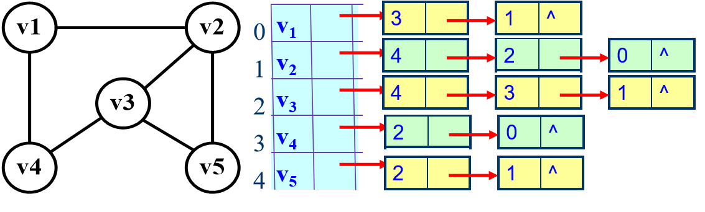

2.邻接矩阵

```c++
#define MAXNum  100		  		 //图中顶点数目的最大值 
typedef  char  VertexType;  	 //顶点信息为字符类型
struct	Graph
{   
    VertexType   Vex[MAXNum];    //顶点表 
    int   Edge[MAXNum][MAXNum];  //邻接矩阵 第一个下标表from,第二个下标表to
    int   vexnum,edgenum;         //顶点数和边数
};
```

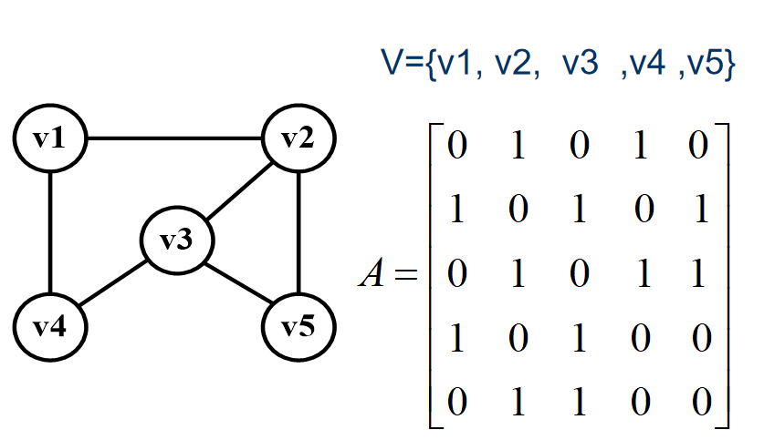

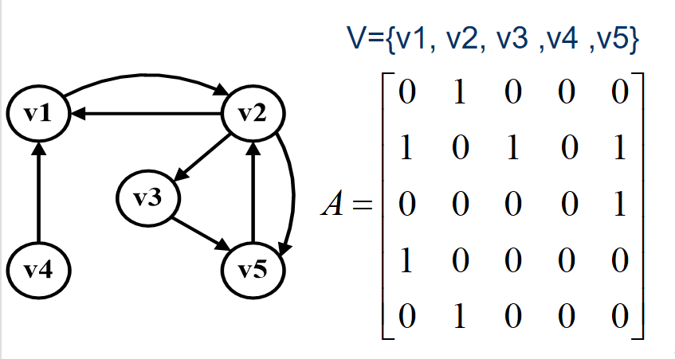

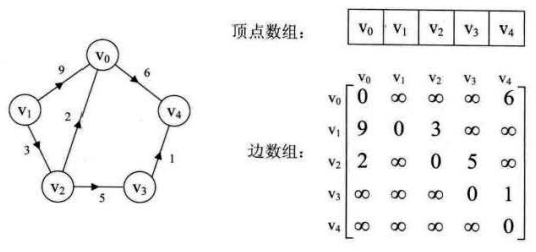

注:

```c++
Edge[20002][20002];//邻接矩阵  蓝桥杯最大栈空间为256MB，即最大可以开10^7左右的数组空间。

//降低空间复杂度
from[20002];
to[20002];
weight[20002];
```

##### 25.2 深度优先搜索

1.在递归中，如果**是处理当前访问的节点**，就需要终止条件;如果**是处理下一个要访问的节点**，就不需要终止条件。

```c++
void dfs(参数) {
    if (终止条件) {
        存放结果;
        return;
    }

    for (选择：本节点所连接的其他节点) {
        处理节点;
        dfs(图，选择的节点); // 递归
        回溯，撤销处理结果
    }
}
```

**有环图避免死循环:**

```c++
1.可以使用一个额外的布尔数组或其他数据结构来记录节点的访问状态。
```

##### 25.3 广度优先搜索

1.适合于解决两个点之间的最短路径问题。

2.容器**用队列，还是用栈，甚至用数组，都是可以的**。

- **用队列的话，就是保证每一圈都是一个方向去转，例如统一顺时针或者逆时针**。
- **用栈的话，就是第一圈顺时针遍历，第二圈逆时针遍历，第三圈有顺时针遍历**。		
- 广搜不需要注意转圈搜索的顺序。

3.**只要 加入队列就代表 走过，就需要标记，而不是从队列拿出来的时候再去标记走过**。

```c++
int dir[4][2] = {0, 1, 1, 0, -1, 0, 0, -1}; // 表示四个方向
// grid 是地图，也就是一个二维数组
// visited标记访问过的节点，不要重复访问
// x,y 表示开始搜索节点的下标
void bfs(vector<vector<char>>& grid, vector<vector<bool>>& visited, int x, int y) {
    queue<pair<int, int>> que; // 定义队列
    que.push({x, y}); // 起始节点加入队列
    visited[x][y] = true; // 只要加入队列，立刻标记为访问过的节点
    while(!que.empty()) { // 开始遍历队列里的元素
        pair<int ,int> cur = que.front(); que.pop(); // 从队列取元素
        int curx = cur.first;
        int cury = cur.second; // 当前节点坐标
        for (int i = 0; i < 4; i++) { // 开始想当前节点的四个方向左右上下去遍历
            int nextx = curx + dir[i][0];
            int nexty = cury + dir[i][1]; // 获取周边四个方向的坐标
            if (nextx < 0 || nextx >= grid.size() || nexty < 0 || nexty >= grid[0].size()) continue;  // 坐标越界了，直接跳过
            if (!visited[nextx][nexty]) { // 如果节点没被访问过
                que.push({nextx, nexty});  // 队列添加该节点为下一轮要遍历的节点
                visited[nextx][nexty] = true; // 只要加入队列立刻标记，避免重复访问
            }
        }
    }

}
```

**有环图避免死循环:**

```c++
1.可以使用一个额外的布尔数组或其他数据结构来记录节点的访问状态。
```

##### 25.4 并查集

1.常用来解决连通性问题(当我们需要判断两个元素是否在同一个集合里的时候)。

2.主要有三个功能：

- 寻找根节点，函数：find(int u)，也就是判断这个节点的祖先节点是哪个
- 将两个节点接入到同一个集合，函数：join(int u, int v)，将两个节点连在同一个根节点上
- 判断两个节点是否在同一个集合，函数：isSame(int u, int v)，就是判断两个节点是不是同一个根节点

```c++
int n = 1005; // n根据题目中节点数量而定
vector<int> father(n, 0); // C++里的一种数组结构

// 并查集初始化
void init() {
    for (int i = 0; i < n; ++i) {
        father[i] = i;
    }
}
// 并查集里寻根的过程
int find(int u) {
    if (u == father[u]) return u;
    else return father[u] = find(father[u]); // 路径压缩，减少下次查询的路径长度
}

// 判断 u 和 v是否找到同一个根
bool isSame(int u, int v) {
    u = find(u);
    v = find(v);
    return u == v;
}

// 将v->u 这条边加入并查集
void join(int u, int v) {
    u = find(u); // 寻找u的根
    v = find(v); // 寻找v的根
    if (u == v) return ; // 如果发现根相同，则说明在一个集合，不用两个节点相连直接返回
    father[v] = u;//from v to u
}
```

3.模拟过程

1、`join(1, 8);`


2、`join(3, 8);`


3、`join(1, 7);`


4、`join(8, 5);`


5、`join(2, 9);`


6、`join(6, 9);`


4.复杂度分析

- 空间复杂度:  O(n) ，申请一个father数组。

- 时间复杂度:  O(logn)与O(1)之间，且随着查询或者合并操作的增加，时间复杂度会越来越趋于O(1)。[在第一次查询的时候，相当于是n叉树上从叶子节点到根节点的查询过程，时间复杂度是logn，但路径压缩后，后面的查询操作都是O(1)，而 join 函数 和 isSame函数 里涉及的查询操作也是一样的过程。]

  


5.并查集问题的一些细节：

1.[冗余连接](https://www.programmercarl.com/0684.%E5%86%97%E4%BD%99%E8%BF%9E%E6%8E%A5.html)


边的两个节点如果不在同一个集合，就加入集合（即：同一个根节点）。


边的两个节点如果在同一个集合，说明边的两个节点已经连在一起了，再加入这条边一定就出现环了。

**注:**如果题目中说：如果有多个答案，则返回二维数组中最前出现的边。 那我们就要 从后向前遍历每一条边了。

##### 25.5 最短路径算法

1.Dijkstra算法——用于计算一个节点到其他节点的最短路径，**要求没有负边权**   时间复杂度$O(n^2)$

基本原理：从起始点出发，重复寻找当前距离起始点最近的且未访问过的结点，然后利用该结点更新距离数组(不包括已访问的点)，直到访问过全部结点为止，最终的距离数组即为起始点到其余各点的最短路径距离。

```c++
//vis[]表示是否被选取了，dis[]表示离源点距离 ，g[][]存储点与点之间距离
const int N = 510, inf = 0x3f3f3f3f;
bool vis[N];
int dis[N], g[N][N], n, m;

int Dijkstra(){
	//初始化源点为1
    dis[1] = 0;
    //从未被选取的点当中选取到达源点最近的点
    for(int i = 0; i < n; i ++ ){//每次循环选取一个点，因此需要for循环遍历n次
        int index = -1;//代表当前未被访问的距离原点最近的点
        for(int j = 1; j <= n; j ++ ){//寻找当前距离起始点最近的且未访问过的结点
            if(!vis[j] && (index == -1 || dis[j] < dis[index] ) ){
                index = j;
            }
        }
        
        vis[index] = true;//找到当前距离原点最小值的点，则把点进行标记被选取。
        //利用这个选取的源点去更新其他未被访问的点
        for(int j = 1; j <= n; j ++ ){
            if(!vis[j] && dis[j] > dis[index] + g[index][j] ){
                dis[j] = dis[index] + g[index][j];
            }
        }
        
    }
    
    if(dis[n] == inf ) 
        return -1;//如果没有到n点的路径，则返回-1
    else
        return dist[n];
    
}
```

参考教程：[算法之迪杰斯特拉（dijkstra）非常详细介绍](https://blog.csdn.net/PRML_MAN/article/details/114477814?ops_request_misc=%257B%2522request%255Fid%2522%253A%2522167964319116800215083018%2522%252C%2522scm%2522%253A%252220140713.130102334..%2522%257D&request_id=167964319116800215083018&biz_id=0&spm=1018.2226.3001.4187)

堆优化的Dijkstra算法（从边的角度）时间复杂度$O(mlogm) $ m 为边的数量

```c++
vector<list<int>> grid(n + 1);
```


```c++
vector<list<pair<int,int>>> grid(n + 1);
```


```c++
struct Edge {
    int to;  // 链接的节点
    int val; // 边的权重

    Edge(int t, int w): to(t), val(w) {}  // 构造函数
};

vector<list<Edge>> grid(n + 1); // 邻接表
```

**代码实现：**

```c++
// 小顶堆
class mycomparison {
public:
    bool operator()(const pair<int, int>& lhs, const pair<int, int>& rhs) {
        return lhs.second > rhs.second;
    }
};

// 定义一个结构体来表示带权重的边
struct Edge {
    int to;  // 邻接顶点
    int val; // 边的权重

    Edge(int t, int w): to(t), val(w) {}  // 构造函数
};


int n, m, p1, p2, val;
cin >> n >> m;

vector<list<Edge>> grid(n + 1);

for (int i = 0; i < m; i++) {
    cin >> p1 >> p2 >> val;
    // p1 指向 p2，权值为 val
    grid[p1].push_back(Edge(p2, val));

}

int start = 1;  // 起点
int end = n;    // 终点

// 存储从源点到每个节点的最短距离
vector<int> minDist(n + 1, INT_MAX);

// 记录顶点是否被访问过
vector<bool> visited(n + 1, false);

// 优先队列中存放 pair<节点，源点到该节点的权值>
priority_queue<pair<int, int>, vector<pair<int, int>>, mycomparison> pq;


// 初始化队列，源点到源点的距离为0，所以初始为0
pq.push(pair<int, int>(start, 0));

minDist[start] = 0;  // 起始点到自身的距离为0

while (!pq.empty()) {
    // 1. 第一步，选源点到哪个节点近且该节点未被访问过 （通过优先级队列来实现）
    // <节点， 源点到该节点的距离>
    pair<int, int> cur = pq.top(); pq.pop();

    if (visited[cur.first]) continue;

    // 2. 第二步，该最近节点被标记访问过
    visited[cur.first] = true;

    // 3. 第三步，更新非访问节点到源点的距离（即更新minDist数组）
    for (Edge edge : grid[cur.first]) { // 遍历 cur指向的节点，cur指向的节点为 edge
        // cur指向的节点edge.to，这条边的权值为 edge.val
        if (!visited[edge.to] && minDist[cur.first] + edge.val < minDist[edge.to]) { // 更新minDist
            minDist[edge.to] = minDist[cur.first] + edge.val;
            pq.push(pair<int, int>(edge.to, minDist[edge.to]));// 由于cur节点的加入，而新链接的边，加入到优先级队里中
        }
    }

}

if (minDist[end] == INT_MAX) cout << -1 << endl; // 不能到达终点
else cout << minDist[end] << endl; // 到达终点最短路径
```

正是因为稀疏图，所以我们使用堆优化的思路， 如果我们还用 邻接矩阵 去表达这个图的话，就是 **一个高效的算法 使用了低效的数据结构，那么 整体算法效率 依然是低的**。

2.SPFA算法——用于计算一个节点到其他节点的最短路径，**不要求没有负边权但不可存在负权回路**；可用于检测负权回路（绕一圈绕回来发现到自己的距离从0变成了负数）时间复杂度$O(n*m)$

基本原理：建立一个队列，逐次用队首结点u对与之相连的全部结点v进行松弛操作，如果结点v的最短路径距离更新，且v不在队列中， 则加入队列，直到队列为空停止。

```c++
const int maxn = 105;  // 最大节点数
const int inf = 0x3f3f3f3f;  // 无穷大距离值，表示不可达

struct edge {
    int v;  // 目标节点
    int w;  // 边的权重
};

vector<edge> e[maxn];  // 图的邻接表表示
int dis[maxn];  // 起始节点到各节点的最短路径距离
int inq[maxn] = {};  // 节点是否在队列中的标记数组  作用是避免重复将同一个节点加入队列，从而减少不必要的遍历和计算
queue<int> q;  // 辅助队列

int spfa(int n, int s) {
    memset(dis, 0x3f, sizeof(dis));  // 初始化距离数组为无穷大
    int cnt[maxn] = {0};  // 记录每个节点的入队次数
    dis[s] = 0;  // 起始节点到自身的距离为0
    inq[s] = true;  // 将起始节点标记为已加入队列
    q.push(s);  // 将起始节点加入队列

    while (!q.empty()) {
        int u = q.front();  // 取出队首节点
        q.pop();
        inq[u] = false;  // 将节点标记为不在队列中

        // 遍历节点u的所有邻居
        for (auto& ed : e[u]) {
            int v = ed.v;  // 目标节点
            int w = ed.w;  // 边的权重

            // 如果通过节点u到达节点v的距离更短，则更新距离数组，并将节点v加入队列
            if (dis[v] > dis[u] + w) {
                dis[v] = dis[u] + w;  // 更新最短路径距离
                if (!inq[v]) {
                    q.push(v);  // 将节点v加入队列
                    inq[v] = true;  // 将节点v标记为已加入队列
                    cnt[v]++;  // 节点入队次数加1
                    // 如果某个节点的入队次数超过n次，说明存在负权回路
                    if (cnt[v] > n) {
                        cout << "存在负权回路" << endl;
                       
                    }
                }
            }
        }
    }
    
    if(dis[n] == inf ) 
        return -1;//如果没有到n点的路径，则返回-1
    else
        return dist[n];
    
}
```

**单源有限最短路（最多经过k个城市的条件下）：**

用一个变量 que_size 记录每一轮松弛入队列的所有节点数量。

下一轮松弛的时候，就把队列里 que_size 个节点都弹出来，就是上一轮松弛入队列的节点。

```c++
struct Edge { //邻接表
    int to;  // 链接的节点
    int val; // 边的权重

    Edge(int t, int w): to(t), val(w) {}  // 构造函数
};

int n, m, p1, p2, val;
cin >> n >> m;

vector<list<Edge>> grid(n + 1); // 邻接表

// 将所有边保存起来
for (int i = 0; i < m; i++) {
    cin >> p1 >> p2 >> val;
    // p1 指向 p2，权值为 val
    grid[p1].push_back(Edge(p2, val));
}
int start, end, k;
cin >> start >> end >> k;

k++;

vector<int> minDist(n + 1, INT_MAX);
vector<int> minDist_copy(n + 1); // 用来记录每一次遍历的结果

minDist[start] = 0;

queue<int> que;
que.push(start); // 队列里放入起点

int que_size;
while (k-- && !que.empty()) {

    vector<bool> visited(n + 1, false); // 每一轮松弛中，控制节点不用重复入队列
    minDist_copy = minDist;
    que_size = que.size();
    while (que_size--) {
        int node = que.front(); que.pop();
        for (Edge edge : grid[node]) {
            int from = node;
            int to = edge.to;
            int price = edge.val;
            if (minDist[to] > minDist_copy[from] + price) {
                minDist[to] = minDist_copy[from] + price;
                if (visited[to]) continue; // 不用重复放入队列，但需要重复松弛，所以放在这里位置
                visited[to] = true;
                que.push(to);
            }
        }

    }
}
if (minDist[end] == INT_MAX) cout << "unreachable" << endl;
else cout << minDist[end] << endl;
```

3.Floyd算法——用于计算任意两个节点之间的最短路径，**不要求没有负边权但不可存在负权回路**；时间复杂度$O(n^3)$

基本原理：通过动态规划的思想，利用中间顶点的集合，逐步更新顶点之间的最短距离。

```c++
for(int k=1;k<=n;k++)// 注意这层循环要放在最外面，中间节点
	for(int i=1;i<=n;i++) 
		for(int j=1;j<=n;j++){//遍历整个图
			if(d[i][k]+d[k][j]<d[i][j])
				d[i][j]=d[i][k]+d[k][j];
```

4.A*算法	

**时间复杂度**	在最坏情况下，A * 退化成广搜，算法的时间复杂度 是 O(n * 2)，n 为节点数量。在最好情况下，是从起点直接到终点，时间复杂度为 O(dlogd)，d 为起点到终点的深度。因为在搜索的过程中也需要堆排序，所以是 O(dlogd)。实际上 A * 的时间复杂度是介于 最好 和最坏 情况之间， 可以 非常粗略的认为 A * 算法的时间复杂度是 O(nlogn) ，n 为节点数量。

**空间复杂度**	O(b ^ d) ,d 为起点到终点的深度，b 是 图中节点间的连接数量。

在搜索最短路的时候， 如果是无权图(边的权值都是1) 那就用广搜，代码简洁，时间效率和 dijkstra 差不多 (具体要取决于图的稠密)。如果是有权图(边有不同的权值)，优先考虑 dijkstra。

A*关键在于启发式函数， 也就是影响广搜从容器(队列)里取元素的优先顺序。


**对队列里节点进行排序，就需要给每一个节点权值。**

每个节点的权值为F，给出公式为：F = G + H

G：起点达到目前遍历节点的距离

F：目前遍历的节点到达终点的距离

起点达到目前遍历节点的距离 + 目前遍历的节点到达终点的距离 就是起点到达终点的距离。

本题的图是无权网格状，在计算两点距离通常有如下三种计算方式：

1. 曼哈顿距离，计算方式： d = abs(x1-x2)+abs(y1-y2)
2. 欧氏距离（欧拉距离） ，计算方式：d = sqrt( (x1-x2)^2 + (y1-y2)^2 )
3. 切比雪夫距离，计算方式：d = max(abs(x1 - x2), abs(y1 - y2))

选择哪一种距离计算方式 也会导致 A * 算法的结果不同。

计算出来 F 之后，按照 F 的 大小，来选去出队列的节点。

可以使用 优先级队列 帮我们排好序，每次出队列，就是F最小的节点。

```c++
int moves[1001][1001];
int dir[8][2]={-2,-1,-2,1,-1,2,1,2,2,1,2,-1,1,-2,-1,-2};
int b1, b2;
// F = G + H
// G = 从起点到该节点路径消耗
// H = 该节点到终点的预估消耗

struct Knight{
    int x,y;
    int g,h,f;
    bool operator < (const Knight & k) const{  // 重载运算符， 从小到大排序
     return k.f < f;
    }
};

priority_queue<Knight> que;

int Heuristic(const Knight& k) { // 欧拉距离
    return (k.x - b1) * (k.x - b1) + (k.y - b2) * (k.y - b2); // 统一不开根号，这样可以提高精度
}

void astar(const Knight& k)
{
    Knight cur, next;
	que.push(k);
	while(!que.empty())
	{
		cur=que.top(); que.pop();
		if(cur.x == b1 && cur.y == b2)
		break;
		for(int i = 0; i < 8; i++)
		{
			next.x = cur.x + dir[i][0];
			next.y = cur.y + dir[i][1];
			if(next.x < 1 || next.x > 1000 || next.y < 1 || next.y > 1000)
			continue;
			if(!moves[next.x][next.y])
			{
				moves[next.x][next.y] = moves[cur.x][cur.y] + 1;

                // 开始计算F
				next.g = cur.g + 5; // 统一不开根号，这样可以提高精度，马走日，1 * 1 + 2 * 2 = 5
                next.h = Heuristic(next);
                next.f = next.g + next.h;
                que.push(next);
			}
		}
	}
}
int main()
{
    int n, a1, a2;
    cin >> n;
    while (n--) {
        cin >> a1 >> a2 >> b1 >> b2;
        memset(moves,0,sizeof(moves));
        Knight start;
        start.x = a1;
        start.y = a2;
        start.g = 0;
        start.h = Heuristic(start);
        start.f = start.g + start.h;
		astar(start);
        while(!que.empty()) que.pop(); // 队列清空
		cout << moves[b1][b2] << endl;
	}
	return 0;
}
```

**A \* 算法并不能保证一定是最短路**，因为在设计 启发式函数的时候，要考虑 时间效率与准确度之间的一个权衡。

如果题目中，给出 多个可能的目标，然后在这多个目标中选择最近的目标，这种 A * 就不擅长了， A * 只擅长给出明确的目标 然后找到最短路径。如果是多个目标找最近目标（特别是潜在目标数量很多的时候），可以考虑 Dijkstra ，BFS 或者 Floyd。

##### 25.6 最小生成树算法

一个连通图的生成树包含图中全部的n个顶点，但只有构成一棵树的n-1条边。

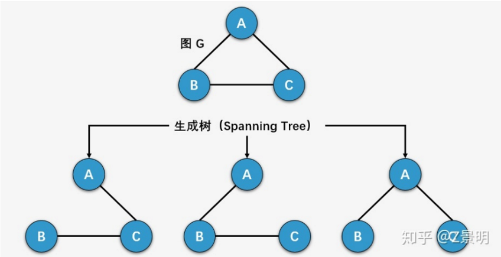

一个带权图的最小生成树，是边的权值之和最小的生成树。

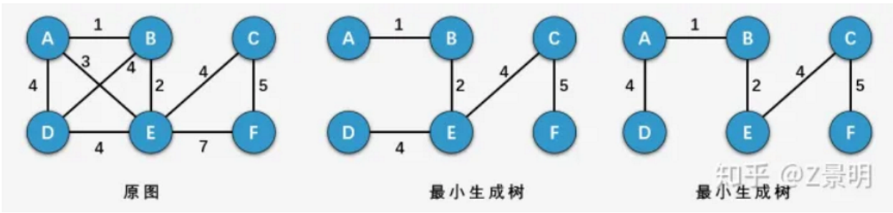

1.Prim算法——适合稠密图	时间复杂度$O(n^2)$     

对图G（V,E）设置集合S，存放已经被访问的顶点，然后执行n次下面的两个步骤（n为顶点个数）：

1. 每次从集合V-S中选择与集合S的最短距离最小的一个顶点（记为u），访问并加入集合S，同时把这条离集合最近的边加入到最小生成树中。
2. 令顶点u为中介点，优化所有从u能到达的**未访问**的顶点v与集合S之间的最短距离。

```c++
const int MAXN = 1005;

int graph[MAXN][MAXN]; // 邻接矩阵
int dis[MAXN]; // 存储顶点到生成树的距离
bool vis[MAXN]; // 标记顶点是否已经加入到生成树中

int Prim(int n) { // n为图的顶点数
    int ans = 0;
    memset(vis, false, sizeof(vis)); // 初始化标记数组为false
    memset(dis, inf, sizeof(dis)); // 初始化到生成树距离为无穷大
    dis[1] = 0; // 从任意一个点开始都可以
    for (int i = 1; i <= n; ++i) {
        int u = -1;
        for (int j = 1; j <= n; ++j) {
            if (!vis[j] && (u == -1 || dis[u] > dis[j])) { // 找到未加入生成树的距离最小的点
                u = j;
            }
        }
        vis[u] = true; // 将找到的点加入生成树
        ans += dis[u]; // 将距离加入到答案中
        for (int v = 1; v <= n; ++v) {
            if (!vis[v] && graph[u][v] < dis[v]) { // 更新未加入生成树的点到生成树的距离
                dis[v] = graph[u][v];
            }
        }
    }
    return ans;
}
```

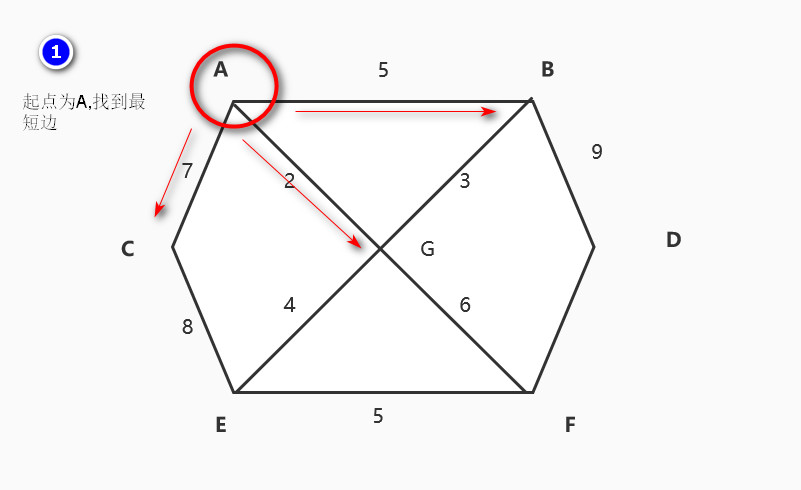

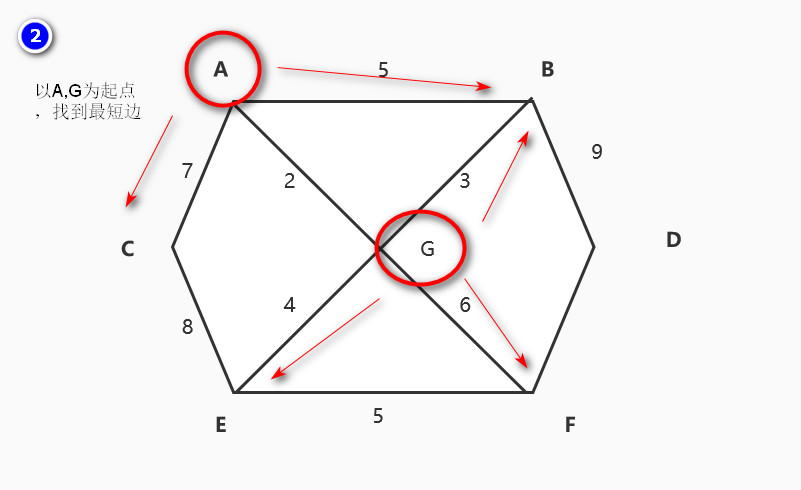

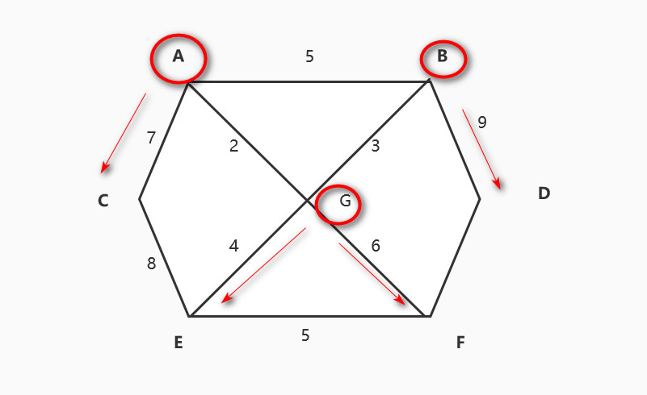

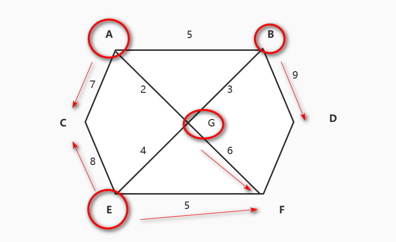

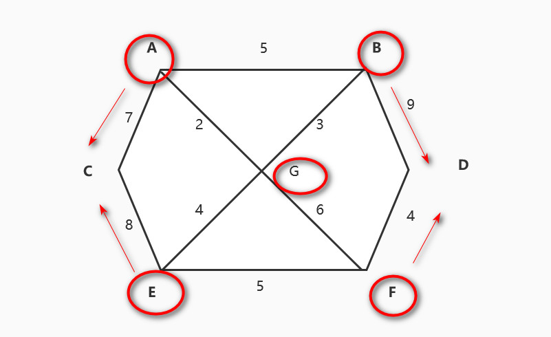

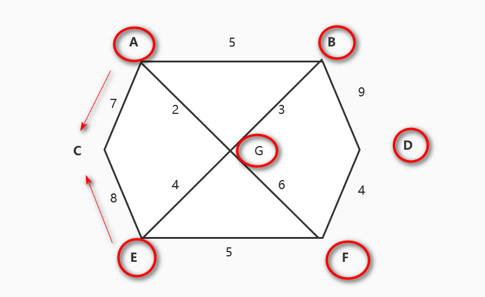

2.Kruskal算法——适合稀疏图  时间复杂度$O(mlogm)$  边的排序——时间复杂度$O(mlogm)$ ；并查集判断两个顶点ui,vi是否属于两颗不同的树——时间复杂度$O(log m)$

基本原理：

1. 把图中的所有边按代价从小到大排序；
2. 把图中的n个顶点看成独立的n棵树组成的森林；
3. 按权值从小到大选择边，所选的边连接的两个顶点ui,vi应属于两颗不同的树，则成为最小生成树的一条边，并将这两颗树合并作为一颗树。
4. 重复(3),直到所有顶点都在一颗树内或者有n-1条边为。

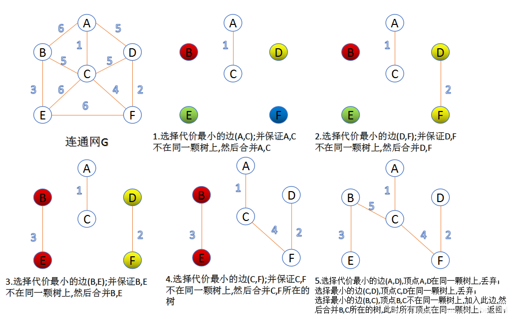

```c++
int n, m; // 节点数和边数
int p[N]; // 并查集数组，用于存储节点的父节点

struct Edge
{
    int a, b, w; // 边的起点、终点和权重

    // 重载小于号，用于边的排序
    bool operator< (const Edge &W) const
    {
        return w < W.w;
    }
    
} edges[M]; // 边数组

int find(int x)
{
    if (p[x] != x) p[x] = find(p[x]); // 查找x的根节点，并路径压缩
    return p[x];
}

int kruskal()
{
    // 将所有边排序
    sort(edges, edges + m);

    for (int i = 1; i <= n; i++) p[i] = i; // 初始化并查集，每个节点的父节点指向自身

    int res = 0; // 最小生成树的权重
    int cnt = 0; // 当前加入最小生成树的边数
    for (int i = 0; i < m; i++)
    {
        int a = edges[i].a, b = edges[i].b, w = edges[i].w; // 当前边的起点、终点和权重

        a = find(a); // 查找起点所在连通分量的根节点
        b = find(b); // 查找终点所在连通分量的根节点
        if (a != b)
        {
            p[a] = b; // 合并起点和终点所在的连通分量，将起点所在连通分量的根节点指向终点所在连通分量的根节点
            res += w; // 将边的权重加入最小生成树的总权重
            cnt++; // 边数加一，表示成功加入了一条边
        }
    }
    
    if (cnt < n - 1) return INF; // 如果最小生成树的边数小于n-1，表示无法构建最小生成树，返回INF
    return res; // 返回最小生成树的权重
}
```

##### 25.7 二分图判定算法


##### 25.8 拓扑排序算法

**1.给出一个有向无环图，把这个有向无环图转成线性的排序 就叫拓扑排序**。

**2.拓扑排序也是图论中判断有向无环图的常用方法**。

实现拓扑排序的算法有两种：**BFS**和DFS

1. 找到入度为0 的节点，加入结果集

2. 将该节点从图中移除

循环以上两步，直到 所有节点都在图中被移除了。


1、找到入度为0 的节点，加入结果集


2、将该节点从图中移除


1、找到入度为0 的节点，加入结果集


2、将该节点从图中移除


1、找到入度为0 的节点，加入结果集


2、将该节点从图中移除


**判断有环：**


如果我们发现结果集元素个数 不等于 图中节点个数，我们就可以认定图中一定有 有向环！

```c++
int m, n, s, t;//n为节点个数 m为依赖关系对数
cin >> n >> m;
vector<int> inDegree(n, 0); // 记录每个文件的入度

unordered_map<int, vector<int>> umap;// 记录文件依赖关系
vector<int> result; // 记录结果

while (m--) {
    // s->t，先有s才能有t
    cin >> s >> t;
    inDegree[t]++; // t的入度加一
    umap[s].push_back(t); // 记录s指向哪些文件
}

queue<int> que;
for (int i = 0; i < n; i++) {
    // 入度为0的文件，可以作为开头，先加入队列
    if (inDegree[i] == 0) que.push(i);
   
}

// int count = 0;
while (que.size()) {
    int  cur = que.front(); // 当前选中的文件
    que.pop();
    //count++;
    result.push_back(cur);
    vector<int> files = umap[cur]; //获取该文件指向的文件
    if (files.size()) { // cur有后续文件
        for (int i = 0; i < files.size(); i++) {
            inDegree[files[i]] --; // cur的指向的文件入度-1
            if (inDegree[files[i]] == 0) que.push(files[i]);
        }
    }
}

if (result.size() == n) {
    for (int i = 0; i < n - 1; i++) cout << result[i] << " ";
    cout << result[n - 1];
}
else cout << -1 << endl;
```

#### 26.递归三要素

1.确定递归函数的参数和返回值

2.确定终止条件

3.确定单层递归的逻辑

#### 27.回溯算法

##### 27.1 回溯和递归是一一对应的，有一个递归，就要有一个回溯!


##### 27.2 **回溯的本质是穷举，穷举所有可能，然后选出我们想要的答案**，如果想让回溯法高效一些，可以加一些剪枝的操作，但也改不了回溯法就是穷举的本质。

##### 27.3 回溯法解决的问题

- 组合问题：N个数里面按一定规则找出k个数的集合
- 切割问题：一个字符串按一定规则有几种切割方式
- 子集问题：一个N个数的集合里有多少符合条件的子集
- 排列问题：N个数按一定规则全排列，有几种排列方式
- 棋盘问题：N皇后，解数独等等

##### 27.4 **回溯法解决的问题都可以抽象为树形结构**!

##### 27.5 回溯法模板

```C++
void backtracking(参数) {
    if (终止条件) {
        存放结果;
        return;
    }

    for (选择：本层集合中元素（树中节点孩子的数量就是集合的大小）) {
        处理节点;
        backtracking(路径，选择列表); // 递归
        回溯，撤销处理结果
    }
}
```


##### 27.6 组合问题和排列问题的一些细节：

1.数组有重复元素，但不能有重复的组合。


2.组合问题for从startIndex开始，排列问题for从0开始。

3.数组有重复元素，但不能有重复的排列。


4.特殊数据定义。

```c++
unordered_map<出发机场, map<到达机场, 航班次数>> targets;
```

#### 28.贪心算法

##### 28.1 **本质是选择每一阶段的局部最优，从而达到全局最优**。

##### 28.2 **没有固定的套路**

##### 28.3 贪心算法问题的一些细节

1.跳跃游戏系列

[跳跃游戏](https://www.programmercarl.com/0055.%E8%B7%B3%E8%B7%83%E6%B8%B8%E6%88%8F.html#%E6%80%9D%E8%B7%AF)

```c++
每次取最大的跳跃步数，这个就是可以跳跃的覆盖范围。
```

2.遇到两个维度权衡的时候，一定要先确定一个维度，再确定另一个维度。

[分发糖果](https://www.programmercarl.com/0135.%E5%88%86%E5%8F%91%E7%B3%96%E6%9E%9C.html#%E7%AE%97%E6%B3%95%E5%85%AC%E5%BC%80%E8%AF%BE)

**规则定义：** 设学生 A和学生 B左右相邻，A 在 B 左边；

- 左规则： 当 $ratings_B$>$ratings_A$ 时，B 的糖比 A 的糖数量多。

- 右规则： 当 $ratings_A$>$ratings_B$ 时，A 的糖比 B 的糖数量多。

相邻的学生中，评分高的学生必须获得更多的糖果 **等价于** 所有学生满足左规则且满足右规则。

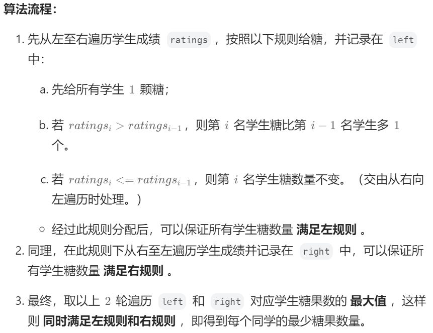

[根据身高重建队列](https://www.programmercarl.com/0406.%E6%A0%B9%E6%8D%AE%E8%BA%AB%E9%AB%98%E9%87%8D%E5%BB%BA%E9%98%9F%E5%88%97.html#%E7%AE%97%E6%B3%95%E5%85%AC%E5%BC%80%E8%AF%BE)

按照身高排序之后，优先按身高高的people的k来插入，后序插入节点也不会影响前面已经插入的节点，最终按照k的规则完成了队列。


3.[用最少数量的箭引爆气球](https://www.programmercarl.com/0452.%E7%94%A8%E6%9C%80%E5%B0%91%E6%95%B0%E9%87%8F%E7%9A%84%E7%AE%AD%E5%BC%95%E7%88%86%E6%B0%94%E7%90%83.html#%E7%AE%97%E6%B3%95%E5%85%AC%E5%BC%80%E8%AF%BE)

局部最优：当气球出现重叠，一起射，所用弓箭最少。

全局最优：把所有气球射爆所用弓箭最少。

**为了让气球尽可能的重叠，需要对数组进行排序**。按照起始位置排序，从前向后遍历气球数组，靠左尽可能让气球重复。

**如果气球重叠了，重叠气球中右边边界的最小值 之前的区间一定需要一个弓箭**。


```c++
class Solution {
private:
    static bool cmp(const vector<int>& a, const vector<int>& b) {
        return a[0] < b[0];
    }
public:
    int findMinArrowShots(vector<vector<int>>& points) {
        if (points.size() == 0) return 0;
        sort(points.begin(), points.end(), cmp);

        int result = 1; // points 不为空至少需要一支箭
        for (int i = 1; i < points.size(); i++) {
            if (points[i][0] > points[i - 1][1]) {  // 气球i和气球i-1不挨着，注意这里不是>=
                result++; // 需要一支箭
            }
            else {  // 气球i和气球i-1挨着
                points[i][1] = min(points[i - 1][1], points[i][1]); // 更新重叠气球最小右边界
            }
        }
        return result;
    }
};
```

4.[单调递增的数字](https://www.programmercarl.com/0738.%E5%8D%95%E8%B0%83%E9%80%92%E5%A2%9E%E7%9A%84%E6%95%B0%E5%AD%97.html#%E7%AE%97%E6%B3%95%E5%85%AC%E5%BC%80%E8%AF%BE)

例如：98，一旦出现strNum[i - 1] > strNum[i]的情况（非单调递增），首先想让strNum[i - 1]--，然后strNum[i]给为9，这样这个整数就是89，即小于98的最大的单调递增整数。

从后向前遍历，就可以重复利用上次比较得出的结果。

5.[监控二叉树](https://www.programmercarl.com/0968.%E7%9B%91%E6%8E%A7%E4%BA%8C%E5%8F%89%E6%A0%91.html#%E7%AE%97%E6%B3%95%E5%85%AC%E5%BC%80%E8%AF%BE)

**局部最优：让叶子节点的父节点安摄像头，所用摄像头最少。**

**整体最优：全部摄像头数量所用最少！**

大体思路就是从下到上，先给叶子节点父节点放个摄像头，然后隔两个节点放一个摄像头，直至到二叉树头结点。

```c++
我们分别有三个数字来表示：
0：该节点无覆盖
1：本节点有摄像头
2：本节点有覆盖
    
空节点的状态只能是有覆盖，这样就可以在叶子节点的父节点放摄像头了。
    
class Solution {
private:
    int result;
    int traversal(TreeNode* cur) {

        // 空节点，该节点有覆盖
        if (cur == NULL) return 2;

        int left = traversal(cur->left);    // 左
        int right = traversal(cur->right);  // 右

        // 情况1
        // 左右节点都有覆盖
        if (left == 2 && right == 2) return 0;

        // 情况2
        // left == 0 && right == 0 左右节点无覆盖
        // left == 1 && right == 0 左节点有摄像头，右节点无覆盖
        // left == 0 && right == 1 左节点有无覆盖，右节点摄像头
        // left == 0 && right == 2 左节点无覆盖，右节点覆盖
        // left == 2 && right == 0 左节点覆盖，右节点无覆盖
        if (left == 0 || right == 0) {
            result++;
            return 1;
        }

        // 情况3
        // left == 1 && right == 2 左节点有摄像头，右节点有覆盖
        // left == 2 && right == 1 左节点有覆盖，右节点有摄像头
        // left == 1 && right == 1 左右节点都有摄像头
        // 其他情况前段代码均已覆盖
        if (left == 1 || right == 1) return 2;

        // 以上代码我没有使用else，主要是为了把各个分支条件展现出来，这样代码有助于读者理解
        // 这个 return -1 逻辑不会走到这里。
        return -1;
    }

public:
    int minCameraCover(TreeNode* root) {
        result = 0;
        // 情况4
        if (traversal(root) == 0) { // root 无覆盖
            result++;
        }
        return result;
    }
};
```

#### 29.动态规划

##### 29.1 动态规划中每一个状态一定是由上一个状态推导出来的.

##### 29.2 解题步骤

1. 确定dp数组以及下标的含义
2. 确定递推公式
3. dp数组如何初始化   **//不一定从0或1开始**
4. 确定遍历顺序
5. 举例推导dp数组

##### 29.3 背包问题

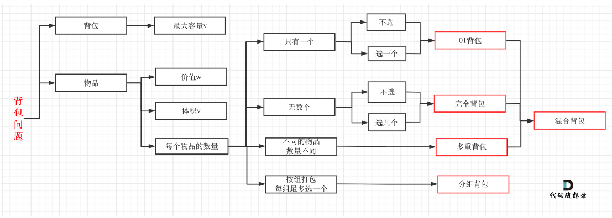

##### 1.01背包

###### 1.1 二维dp数组_01背包

1. 确定dp数组以及下标的含义

   ```c++
   dp[i][j] 表示从下标为[0-i]的物品里任意取，放进容量为j的背包，价值总和最大是多少。
   ```

   

2. 确定递推公式

   ```c++
   dp[i][j] = max(dp[i - 1][j], dp[i - 1][j - weight[i]] + value[i]);//不放物品i和放物体i

3. dp数组如何初始化   **//不一定从0或1开始**

   ```c++
   // 初始化 dp
   vector<vector<int>> dp(weight.size(), vector<int>(bagweight + 1, 0));
   for (int j = weight[0]; j <= bagweight; j++) {
       dp[0][j] = value[0];
   }
   ```

   

4. 确定遍历顺序

   **for循环遍历的次序可变**

   ```c++
   // weight数组的大小 就是物品个数
   for(int i = 1; i < weight.size(); i++) { // 遍历物品
       for(int j = 0; j <= bagweight; j++) { // 遍历背包容量
           if (j < weight[i]) dp[i][j] = dp[i - 1][j];
           else dp[i][j] = max(dp[i - 1][j], dp[i - 1][j - weight[i]] + value[i]);
       }
   }

5. 举例推导dp数组

###### 1.2 一维dp数组(滚动数组)_01背包

1. 确定dp数组以及下标的含义

   满足的条件是上一层可以重复利用，直接拷贝到当前层。

   ```c++
   dp[j] 表示容量为j的背包，所背的物品价值可以最大为dp[j]。

2. 确定递推公式

   ```c++
   dp[j] = max(dp[j], dp[j - weight[i]] + value[i]);//不放物品i和放物体
   ```

3. dp数组如何初始化   **//不一定从0或1开始**

   都初始为0。

4. 确定遍历顺序

   倒序遍历的原因是，本质上还是一个对二维数组的遍历，并且右下角的值依赖上一层左上角的值，因此需要保证左边的值仍然是上一层的，从右向左覆盖。

   **for循环遍历的次序不可变**

   ```c++
   for(int i = 0; i < weight.size(); i++) { // 遍历物品
       for(int j = bagWeight; j >= weight[i]; j--) { // 遍历背包容量
           dp[j] = max(dp[j], dp[j - weight[i]] + value[i]);
       }
   }
   ```
   
5. 举例推导dp数组

###### 1.3 01背包问题的一些细节

1.[目标和](https://www.programmercarl.com/0494.%E7%9B%AE%E6%A0%87%E5%92%8C.html)

可知left组合 - right组合 = target、left + right = sum，故left = (target + sum)/2。

```c++
class Solution {
public:
    int findTargetSumWays(vector<int>& nums, int S) {
        int sum = 0;
        for (int i = 0; i < nums.size(); i++) sum += nums[i];
        if (abs(S) > sum) return 0; // 此时没有方案
        if ((S + sum) % 2 == 1) return 0; // 此时没有方案
        int bagSize = (S + sum) / 2;
        vector<int> dp(bagSize + 1, 0);
        dp[0] = 1;
        for (int i = 0; i < nums.size(); i++) {
            for (int j = bagSize; j >= nums[i]; j--) {
                dp[j] += dp[j - nums[i]];
            }
        }
        return dp[bagSize];
    }
};
```

2.组合类问题/装满背包有几种方法

```c++
dp[0]=1;
dp[j] += dp[j - nums[i]];
```

3.排列类问题/装满背包有几种方法

```c++

```

##### 2.完全背包

###### 2.1 二维dp数组_完全背包

**01背包和完全背包唯一不同体现在递推公式上！**

1. 确定dp数组以及下标的含义

   ```c++
   dp[i][j] 表示从下标为[0-i]的物品里任意取，放进容量为j的背包，价值总和最大是多少。
   ```

   

2. 确定递推公式

   ```c++
   dp[i][j] = max(dp[i - 1][j], dp[i][j - weight[i]] + value[i]);//不放物品i和放物体i
   ```

3. dp数组如何初始化   **//不一定从0或1开始**

   ```c++
   // 初始化 dp
   vector<vector<int>> dp(weight.size(), vector<int>(bagweight + 1, 0));
   for (int j = weight[0]; j <= bagweight; j++) {
       dp[0][j] = dp[0][j-weight[0]]+value[0];
   }
   ```

   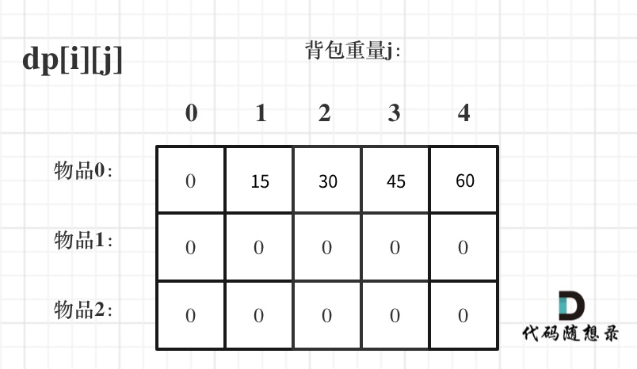

4. 确定遍历顺序

   **for循环遍历的次序可变**

   ```c++
   // weight数组的大小 就是物品个数
   for(int i = 1; i < weight.size(); i++) { // 遍历物品
       for(int j = 0; j <= bagweight; j++) { // 遍历背包容量
           if (j < weight[i]) dp[i][j] = dp[i - 1][j];
           else dp[i][j] = max(dp[i - 1][j], dp[i][j - weight[i]] + value[i]);
       }
   }
   ```

5. 举例推导dp数组

###### 2.2 一维dp数组(滚动数组)_完全背包

**01背包和完全背包唯一不同体现在遍历顺序上！**

1. 确定dp数组以及下标的含义

   满足的条件是上一层可以重复利用，直接拷贝到当前层。

   ```c++
   dp[j] 表示容量为j的背包，所背的物品价值可以最大为dp[j]。
   ```

2. 确定递推公式

   ```c++
   dp[j] = max(dp[j], dp[j - weight[i]] + value[i]);//不放物品i和放物体
   ```

3. dp数组如何初始化   **//不一定从0或1开始**

   都初始为0。

4. 确定遍历顺序

   **for循环遍历的次序可变**

   ```c++
   for(int i = 0; i < weight.size(); i++) { // 遍历物品
       for(int j = weight[i]; j <= bagWeight ; j++) { // 遍历背包容量
           dp[j] = max(dp[j], dp[j - weight[i]] + value[i]);
       }
   }
   ```

5. 举例推导dp数组

###### 2.3 完全背包问题的一些细节

1.组合类问题/装满背包有几种方法

```c++
//纯完全背包求得装满背包的最大价值是多少，和凑成总和的元素有没有顺序没关系，故for循环遍历的次序可变
// 外层for循环遍历物品，内层for遍历背包容量，得到方法的数量只有{物体1,物体2,...，物体n-1,物体n}这种情况
dp[0]=1;
for(int i = 0; i < weight.size(); i++) { // 遍历物品
    for(int j = weight[i]; j <= bagWeight ; j++) { // 遍历背包容量
        dp[j] += dp[j - weight[i]];
    }
}
```

2.排列类问题/装满背包有几种方法

考虑物体之间的顺序，例如物体集{1,2}，结果集会包含{1,1,2}、{2,1,1}、{1,2,1}。

```c++
//纯完全背包求得装满背包的最大价值是多少，和凑成总和的元素有没有顺序没关系，故for循环遍历的次序可变
// 外层for循环遍历背包容量，内层for遍历物体，得到方法的数量不止{物体1,物体2,...，物体n-1,物体n}这种情况
dp[0]=1;
for(int j = 0; j <= bagWeight; j++) { // 遍历背包容量
    for(int i = 0; i < weight.size(); i++) { // 遍历物品
        if (j - weight[i] >= 0) dp[j] += dp[j - weight[i]];
    }
}
```

##### 3.多重背包

每件物体最多有$M_i$件可用，把$M_i$件摊开，就是一个01背包问题。

##### **4.混合背包**

```c++
// 全局变量定义
int m, n; // m是背包容量，n是物品数量
int w[31], c[31], p[31]; // w[i]是第i个物品的重量，c[i]是第i个物品的价值，p[i]是第i个物品的数量或类型（0表示无限，非0表示数量）
int f[201]; // f[j]表示容量为j的背包能装下的最大价值

int main()
{
    // 读取背包容量和物品数量
    scanf("%d%d", &m, &n);
    // 读取每个物品的重量、价值和数量或类型
    for (int i = 1; i <= n; i++)
        scanf("%d%d%d", &w[i], &c[i], &p[i]);
    
    // 动态规划求解混合背包问题
    for (int i = 1; i <= n; i++)
    {
        if (p[i] == 0) // 如果物品i是无限数量的（完全背包问题）
        {
            // 完全背包问题的处理方式：正序更新f数组
            for (int j = w[i]; j <= m; j++)
                f[j] = max(f[j], f[j - w[i]] + c[i]);
        }
        else // 如果物品i是有限数量的（01背包或多重背包问题）
        {
            // 01背包和多重背包的处理方式：逆序更新f数组
            // 这里假设p[i]是物品i的数量，但实际上代码中没有使用p[i]来限制物品i的选择次数
            for (int j = 1; j <= p[i]; j++) // 这里的j应该表示物品i的选择次数，但实际代码中并未体现
                for (int k = m; k >= w[i]; k--)
                    f[k] = max(f[k], f[k - w[i]] + c[i]);
        }
    }
    
    // 输出背包容量为m时的最大价值
    printf("%d", f[m]);
    
    return 0; // 程序正常结束
}
```

##### 5.分组背包


```c++
// 代码有点问题，后续再修改
// 全局变量定义
int dp[105]; // dp[j]表示容量为j的背包能装下的最大价值
int a[105][105]; // a[p][k]记录第p组的第k个物品对应的原始物品编号，a[p]记录第p组的物品数量
int i, j, k, n, v, t; // 临时变量和输入变量
int w[1000], c[1000], p; // w[i]是第i个物品的重量，c[i]是第i个物品的价值，p是物品所属的组别

int main()
{
    // 读取背包容量v、物品总数n和组数t
    cin >> v >> n >> t;
    // 读取每个物品的重量、价值和所属组别，并将物品编号存入对应的组中
    for (i = 1; i <= n; i++)
    {
        cin >> w[i] >> c[i] >> p;
        a[p][++a[p]] = i; // 将物品i存入第p组的a[p]位置，同时更新a[p]表示第p组的物品数量
    }
    
    // 动态规划求解背包问题
    for (i = 1; i <= t; i++) // 枚举每一组
    {
        for (j = v; j >= 0; j--) // 枚举背包的容量
        {
            for (k = 1; k <= a[i]; k++) // 枚举当前组的每一个物品
            {
                if (j >= w[a[i][k]]) // 如果当前背包容量大于等于物品的重量
                    dp[j] = max(dp[j], dp[j - w[a[i][k]]] + c[a[i][k]]); // 更新dp数组
            }
        }
    }
    
    // 输出背包容量为v时的最大价值
    cout << dp[v] << endl;
    
    return 0; // 程序正常结束
}
```

##### 29.4 动态规划问题的一些细节

1.[打家劫舍 II](https://www.programmercarl.com/0213.%E6%89%93%E5%AE%B6%E5%8A%AB%E8%88%8DII.html#%E7%AE%97%E6%B3%95%E5%85%AC%E5%BC%80%E8%AF%BE)

**环状排列** 意味着第一个房子和最后一个房子中 **只能选择一个偷窃**，因此可以把此 **环状排列房间** 问题约化为两个 **单排排列房间** 子问题：

1. 在不偷窃第一个房子的情况下（即 nums[1:n]），最大金额是 p1；
2. 在偷窃第一个房子的情况下（即 nums[0:n−1]），最大金额是 p2；

综合偷窃最大金额： 为以上两种情况的较大值，即 max(p1,p2)。

2.[打家劫舍 III](https://www.programmercarl.com/0337.%E6%89%93%E5%AE%B6%E5%8A%AB%E8%88%8DIII.html)——树形dp

**本题一定是要后序遍历，因为通过递归函数的返回值来做下一步计算**。

3.股票问题

```c++
dp[i][0] 表示第i天持有股票所得最多现金;
dp[i][1] 表示第i天不持有股票所得最多现金;
```

[买卖股票的最佳时机 III](https://www.programmercarl.com/0123.%E4%B9%B0%E5%8D%96%E8%82%A1%E7%A5%A8%E7%9A%84%E6%9C%80%E4%BD%B3%E6%97%B6%E6%9C%BAIII.html#%E6%80%9D%E8%B7%AF)

```c++
一天一共就有五个状态，
0.没有操作 （其实我们也可以不设置这个状态）
1.第一次持有股票
2.第一次不持有股票
3.第二次持有股票
4.第二次不持有股票
dp[i][j]中 i表示第i天，j为 [0 - 4] 五个状态，dp[i][j]表示第i天状态j所剩最大现金。
```

[最佳买卖股票时机含冷冻期](https://www.programmercarl.com/0309.%E6%9C%80%E4%BD%B3%E4%B9%B0%E5%8D%96%E8%82%A1%E7%A5%A8%E6%97%B6%E6%9C%BA%E5%90%AB%E5%86%B7%E5%86%BB%E6%9C%9F.html#%E7%AE%97%E6%B3%95%E5%85%AC%E5%BC%80%E8%AF%BE)

```c++
0.持有股票状态
1.不持有股票状态且不在冷冻期
2.今天卖出股票状态
3.不持有股票状态且在冷冻期
```

4.子序列问题

 [最长递增子序列](https://www.programmercarl.com/0300.%E6%9C%80%E9%95%BF%E4%B8%8A%E5%8D%87%E5%AD%90%E5%BA%8F%E5%88%97.html#%E7%AE%97%E6%B3%95%E5%85%AC%E5%BC%80%E8%AF%BE)

```c++
dp[i]表示i之前包括i的以nums[i]结尾的最长递增子序列的长度
    
全初始化为1
```

[最长重复子数组](https://www.programmercarl.com/0718.%E6%9C%80%E9%95%BF%E9%87%8D%E5%A4%8D%E5%AD%90%E6%95%B0%E7%BB%84.html#%E7%AE%97%E6%B3%95%E5%85%AC%E5%BC%80%E8%AF%BE)

```c++
dp[i][j] ：以下标i - 1为结尾的A，和以下标j - 1为结尾的B，最长重复子数组长度为dp[i][j]。 （特别注意： “以下标i - 1为结尾的A” 标明一定是 以A[i-1]为结尾的字符串 ）
```

5.编辑距离问题——给定字符串s和t，考虑删除、增加和替换等情况，解决s和t的子序列相等等问题

[不同的子序列](https://www.programmercarl.com/0115.%E4%B8%8D%E5%90%8C%E7%9A%84%E5%AD%90%E5%BA%8F%E5%88%97.html#%E7%AE%97%E6%B3%95%E5%85%AC%E5%BC%80%E8%AF%BE)

```c++
dp[i][j]：以i-1为结尾的s子序列中出现以j-1为结尾的t的个数为dp[i][j]
```

[两个字符串的删除操作](https://www.programmercarl.com/0583.%E4%B8%A4%E4%B8%AA%E5%AD%97%E7%AC%A6%E4%B8%B2%E7%9A%84%E5%88%A0%E9%99%A4%E6%93%8D%E4%BD%9C.html#%E7%AE%97%E6%B3%95%E5%85%AC%E5%BC%80%E8%AF%BE)

```c++
dp[i][j]：以i-1为结尾的字符串word1，和以j-1为结尾的字符串word2，想要达到相等，所需要删除元素的最少次数
```

[编辑距离](https://www.programmercarl.com/0072.%E7%BC%96%E8%BE%91%E8%B7%9D%E7%A6%BB.html#%E6%80%9D%E8%B7%AF)

```c++
dp[i][j] 表示以下标i-1为结尾的字符串word1，和以下标j-1为结尾的字符串word2，最少编辑距离为dp[i][j]
 
//递推公式
if (word1[i - 1] == word2[j - 1]) {
    dp[i][j] = dp[i - 1][j - 1];
}
else {
    dp[i][j] = min({dp[i - 1][j - 1], dp[i - 1][j], dp[i][j - 1]}) + 1;//替换元素、word1删除一个元素（word2添加一个元素）、word2删除一个元素（word1添加一个元素）
}
```

6.回文

[回文子串](https://www.programmercarl.com/0647.%E5%9B%9E%E6%96%87%E5%AD%90%E4%B8%B2.html#%E7%AE%97%E6%B3%95%E5%85%AC%E5%BC%80%E8%AF%BE)

```c++
布尔类型的dp[i][j]：表示区间范围[i,j] （注意是左闭右闭）的子串是否是回文子串，如果是，dp[i][j]为true，否则为false
    
/*
情况一：下标i 与 j相同，同一个字符例如a，当然是回文子串
情况二：下标i 与 j相差为1，例如aa，也是回文子串
情况三：下标：i 与 j相差大于1的时候，例如cabac，此时s[i]与s[j]已经相同了，我们看i到j区间是不是回文子串就看aba是不是回文就可以了，那么aba的区间就是 i+1 与 j-1区间，这个区间是不是回文就看dp[i + 1][j - 1]是否为true。
*/
if (s[i] == s[j]) {
    if (j - i <= 1) { // 情况一 和 情况二
        result++;
        dp[i][j] = true;
    } else if (dp[i + 1][j - 1]) { // 情况三
        result++;
        dp[i][j] = true;
    }
}    

全初始化为false
    
从下到上，从左到右遍历//注意因为dp[i][j]的定义，所以j一定是大于等于i的，那么在填充dp[i][j]的时候一定是只填充右上半部分
```


[最长回文子序列](https://www.programmercarl.com/0516.%E6%9C%80%E9%95%BF%E5%9B%9E%E6%96%87%E5%AD%90%E5%BA%8F%E5%88%97.html#%E7%AE%97%E6%B3%95%E5%85%AC%E5%BC%80%E8%AF%BE)

```c++
dp[i][j]：字符串s在[i, j]范围内最长的回文子序列的长度为dp[i][j]
    
    
//如果s[i]与s[j]不相同，说明s[i]和s[j]的同时加入 并不能增加[i,j]区间回文子序列的长度，那么分别加入s[i]、s[j]看看哪一个可以组成最长的回文子序列。
if (s[i] == s[j]) {
    dp[i][j] = dp[i + 1][j - 1] + 2;
} else {
    dp[i][j] = max(dp[i + 1][j], dp[i][j - 1]);
}

当i与j相同，那么dp[i][j]一定是等于1的,其他情况dp[i][j]初始为0就行

从下到上，从左到右遍历//注意因为dp[i][j]的定义，所以j一定是大于等于i的，那么在填充dp[i][j]的时候一定是只填充右上半部分
```


##### 29.5 状态压缩 DP

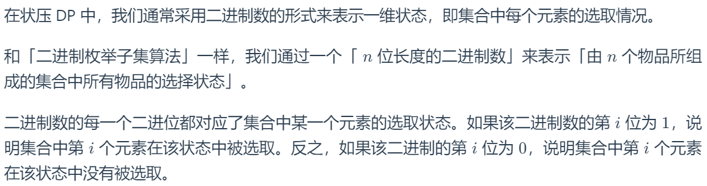

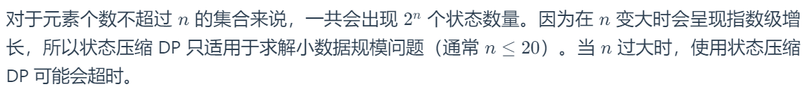

#### 30.单调栈

1.**通常是一维数组，要寻找任一个元素的右边或者左边第一个比自己大或者小的元素的位置，可以用单调栈**。时间复杂度为O(n)。

2.**单调栈的本质是空间换时间**，因为在遍历的过程中需要用一个栈来记录右边第一个比当前元素高的元素，优点是整个数组只需要遍历一次。

3.单调栈里只需要存放元素的下标i就可以了，如果需要使用对应的元素，直接T[i]就可以获取。

4.如果求一个元素右边第一个更大元素，单调栈就是递增的，如果求一个元素右边第一个更小元素，单调栈就是递减的。[**顺序的描述为 从栈头到栈底的顺序**]

5.使用单调栈主要有三个判断条件。

- 当前遍历的元素T[i]小于栈顶元素T[st.top()]的情况
- 当前遍历的元素T[i]等于栈顶元素T[st.top()]的情况
- 当前遍历的元素T[i]大于栈顶元素T[st.top()]的情况

6.如果求一个元素左边第一个更大或更小元素，与求一个元素右边第一个更大或更小元素区别在于倒序遍历数组。

```cpp
// 寻找任一个元素的右边比自己大的元素出现在几天后
class Solution {
public:
    vector<int> dailyTemperatures(vector<int>& T) {
        // 递增栈
        stack<int> st;
        vector<int> result(T.size(), 0);
        st.push(0);
        for (int i = 1; i < T.size(); i++) {
            if (T[i] < T[st.top()]) {                       // 情况一
                st.push(i);
            } else if (T[i] == T[st.top()]) {               // 情况二
                st.push(i);
            } else {
                while (!st.empty() && T[i] > T[st.top()]) { // 情况三
                    result[st.top()] = i - st.top();
                    st.pop();
                }
                st.push(i);
            }
        }
        return result;
    }
};
```

7.单调栈问题的一些细节：

1.[接雨水](https://www.programmercarl.com/0042.%E6%8E%A5%E9%9B%A8%E6%B0%B4.html)

- 双指针优化


- 单调栈


- 雨水高度是 min(凹槽左边高度, 凹槽右边高度) - 凹槽底部高度；
- 雨水的宽度是 凹槽右边的下标 - 凹槽左边的下标 - 1；

#### 31.前缀和与差分

##### 31.1 前缀和

前缀和是数列的前 $n$ 项的和，是一种重要的预处理方式，能大大降低查询的时间复杂度。

**一维前缀和公式和初始化**

为了方便，这里前缀和下标统一从 $1$ 开始  

一维前缀和初始化

```C++
s[0] = 0；
```

一维前缀和定义

```c++
for (int i = 1; i <= n; i ++) 
    s[i] = s[i - 1] + a[i];
```

一维前缀和计算  

计算$[l,r]$子区间的和

```c++
s[r]-s[l-1]
```

**二维前缀和公式和初始化**

为了方便，这里前缀和下标统一从 $1$ 开始  

二维前缀和初始化

```C++
s[0][0] = 0;
```

二维前缀和定义

```C++
for (int i = 1; i <= n; i ++)
    for (int j = 1; j <= m; j ++)
        s[i][j] = s[i - 1][j]  + s[i][j - 1] - s[i - 1][j - 1] + a[i][j];
```

二维前缀和计算  

计算 $(x1, y1)(x2, y2)$ 子矩阵的和 

```c++
s[x2][y2] - s[x2][y1 - 1] - s[x1 - 1][y2] + s[x1 - 1][y1 - 1]  
```

##### 31.2 差分

差分是前缀和的逆运算。

**一维差分**

为了方便，这里差分下标统一从 $1$ 开始  

```c++
b[i] = a[i] - a[i - 1];
```

差分数组能够在 $O(1)$ 的时间复杂度内计算出将原数组 $[l, r]$ 之间的数加上一个常数后，在$O(n)$的时间复杂度内计算出新数组的值。

一维差分初始化

```c++
b[0] = 0;
```

核心操作

```c++
void insert(int l, int r, int c){
    b[l] += c;
    b[r + 1] -= c;
}
```

一维差分定义

```c++
for (int i = 1; i <= n; i ++) 
    insert(i, i, a[i]);// 根据a[i]初始化b[i]
```

还原成新数组

```c++
for (int i = 1; i <= n; i ++){
	a[i] = a[i - 1] + b[i];// 根据修改后的b[i]更新a[i] 参考一维前缀和公式
}
```

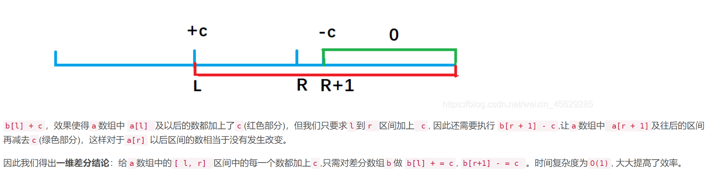

**二维差分**

为了方便，这里差分下标统一从 $1$ 开始  

```
b[i][j] = a[i][j] − a[i − 1][j] − a[i][j − 1] + a[i −1 ][j − 1];
```

差分数组能够在 $O(1)$ 的时间复杂度内计算出将原矩阵以`(x1,y1)`为左上角，以`(x2,y2)`为右下角所围成的矩形区域的数加上一个常数后，在$O(n^2)$的时间复杂度内计算出新数组的值。

二维差分初始化

```c++
b[0][0] = 0;
```

核心操作

```c++
void insert(int x1,int y1,int x2,int y2,int c)
{   //对b数组执行插入操作，等价于对a数组中的(x1,y1)到(x2,y2)之间的元素都加上了c
    b[x1][y1] += c;
    b[x2 + 1][y1] -= c;
    b[x1][y2 + 1] -= c;
    b[x2 + 1][y2 + 1] += c;
}
```

二维差分定义

```c++
for (int i = 1; i <= n; i ++)
	for (int j = 1; j <= m; j ++)
		insert(i, j, i, j, a[i][j]);// 根据a[i][j]初始化b[i][j]
```

还原成新数组

```c++
for (int i = 1; i <= n; i ++){
	for (int j = 1; j <= m; j ++){
		a[i][j] = a[i - 1][j] + a[i][j - 1] - a[i - 1][j - 1] + b[i][j];// 根据修改后的b[i][j]更新a[i][j] 参考二维前缀和公式   
	}
}
```

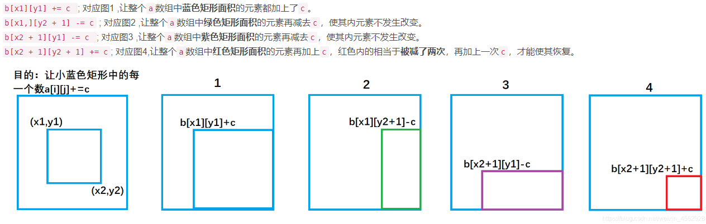

#### 32.记忆化递归

普通的递归可能会重复求解某一值，同样的子问题可能会被求解多次。

解决方法：**把历史求解（子问题）记录下来**，如果下次需要求解子问题，直接取出就好。其时间复杂度为$O(1)$。

#### 33.排序

##### 33.1 快速排序

以一个数为基准，将数组分为两个子序列，左子序列放比基准数小的，右子序列放比基准数大的数，然后再将子序列以以上方式同样分割，直到数组有序。

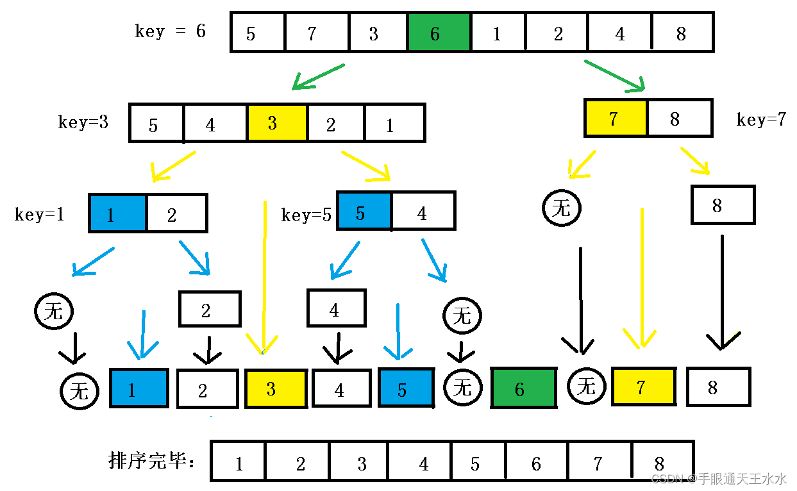


```c++
// 区间定义[left,right]
void quick_sort(int q[], int l, int r) {
    if (l >= r) return;  // 如果左边界大于等于右边界，说明已经排好序或者只有一个元素，直接返回

    int x = q[(l + r) / 2];  // 选择中间的元素作为基准值 向下取整
    // 霍尔法单趟排序
    int i = l, j = r;  // 初始化左右指针

    while (i < j) {
        while (q[i] < x) i++;  // 从左往右找到第一个大于等于基准值的元素的下标
        while (q[j] > x) j--;  // 从右往左找到第一个小于等于基准值的元素的下标

        if (i < j) swap(q[i], q[j]);  // 如果左指针小于右指针，交换对应位置上的元素，使得小于基准值的元素在左边，大于基准值的元素在右边
    }

    quick_sort(q, l, j);  // 对左半部分进行递归排序
    quick_sort(q, j + 1, r);  // 对右半部分进行递归排序
}
```

**时间复杂度分析:**

单趟排序的时间复杂度为$O(n)$，加上递归最好和平均的时间复杂度是$O(n*log n)$，最坏的时间复杂度是$O(n^2)$。

**空间复杂度分析:**

最好和平均的空间复杂度是$O(log n)$，最坏的空间复杂度是$O(n)$。

##### 33.2 归并排序

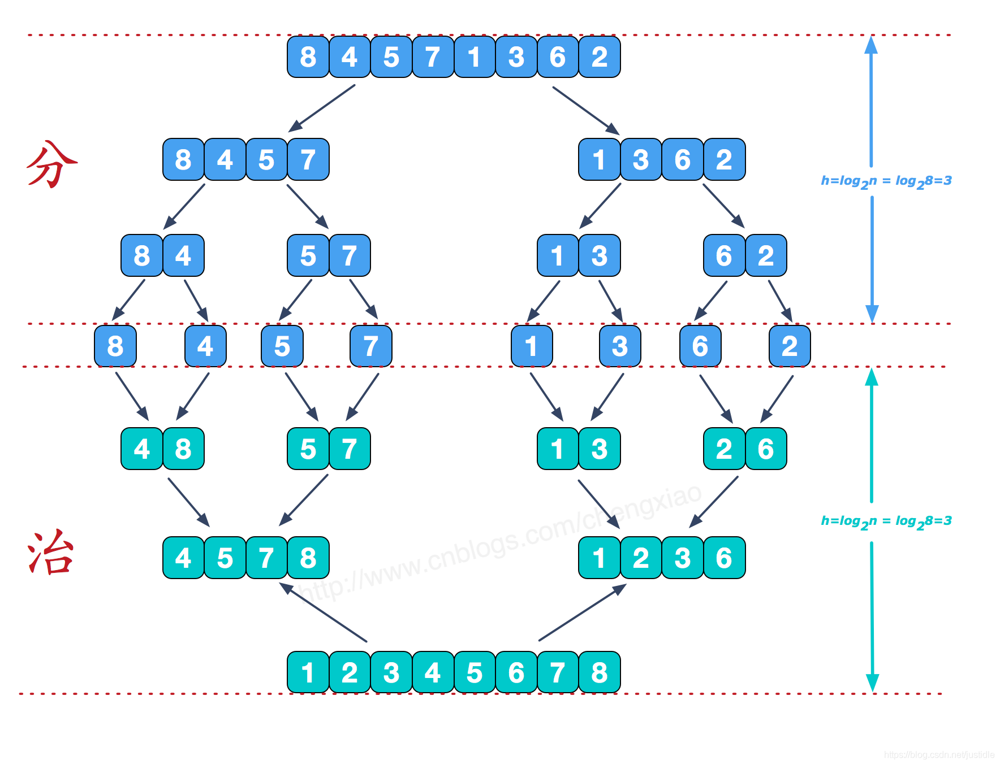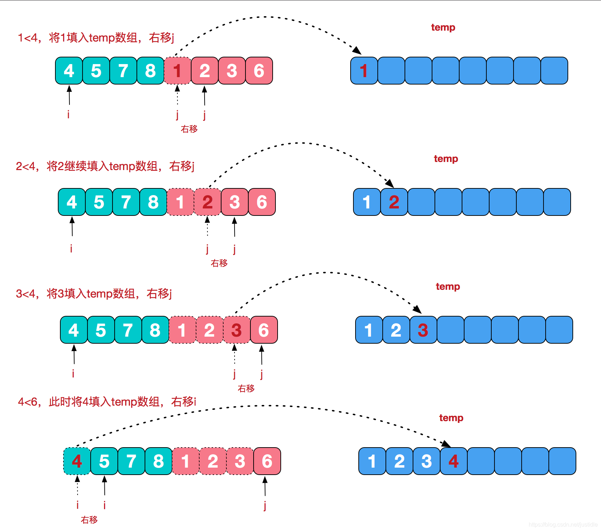

```c++
const int MAXN = 100000;  // 临时数组的最大长度
int tmp[MAXN];  // 定义临时数组

// 区间定义[left,right]
void merge_sort(int q[], int l, int r){
    if (l >= r) return;  // 当子数组只有一个元素时，递归终止
    
    int mid = (l + r) / 2;  // 计算中间位置  向下取整
    
    merge_sort(q, l, mid);  // 对左半部分进行归并排序
    merge_sort(q, mid + 1, r);  // 对右半部分进行归并排序
    
    int k = 0;  // 临时数组的索引
    int i = l, j = mid + 1;  // 左半部分和右半部分的起始位置
    
    while (i <= mid && j <= r){
        if (q[i] <= q[j]) 
            tmp[k ++] = q[i ++];  // 将左半部分的元素放入临时数组
        else 
            tmp[k ++] = q[j ++];  // 将右半部分的元素放入临时数组
    }
    
    while (i <= mid) 
        tmp[k ++] = q[i ++];  // 如果左半部分还有剩余元素，将其放入临时数组
    
    while (j <= r) 
        tmp[k ++] = q[j ++];  // 如果右半部分还有剩余元素，将其放入临时数组
    
    k = 0;
    while (l <= r) 
        q[l ++] = tmp[k ++];  // 将临时数组中的有序元素放回原数组中
}
```

**时间复杂度分析:**

分的时间复杂度为$O(log n)$，治的时间复杂度为$O(n)$,时间复杂度为$O(n*log n)$。

**空间复杂度分析:**

空间复杂度为$O(n+log(n))$。

**与快速排序的对比:**

1.归并排序稳定，而快速排序不稳定。

2.快速排序在平均情况下通常比归并排序更快。

#### 34.位运算

##### 34.1 输出数字 $x$ 二进制表示的第 $i$ 位数字  

- 原理：将第 $i$ 位右移 $i$ 移到最低位上，和 $1$ 做与的运算，如果第 $i$ 位为 $0$，则输出 $0$，如果第 $i$ 位为 $1$，则输出 $1$，这样就取出了第 $i$ 位数字

```C++
int find(int x, int i){
    return x >> i & 1;
}
```

##### 34.2 删除数字 $x$ 的最后一位 $1$  

- 原理：如果 $x$ 的二进制表示为 $1101000$，那么 $x-1$ 二进制表示为 $1100111$，`x & (x - 1)`计算的结果为 $1100000$，最后一位 $1$ 变成了 $0$，其它位不变

```C++
x & (x - 1);
```

##### 34.3 返回数字 $x$ 的最后一位 $1$  

- 原理：如果 x 的二进制表示为 $1101000$，那么 ~x 二进制表示为 $0010111$，~x+1 二进制表示为 $0011000$，`x & (~x+1) == x & (-x)`的计算结果为 $0001000$ 只保留了最后一位 $1$，其余位都为 $0$

```C++
int lowbit(int x){
    return x & (-x);
}
```

#### 35.二进制枚举子集

使用二进制数第 1∼𝑛 位上 0 或 1 的状态来表示一个由 1∼𝑛 组成的集合。也就是说通过二进制来枚举子集。

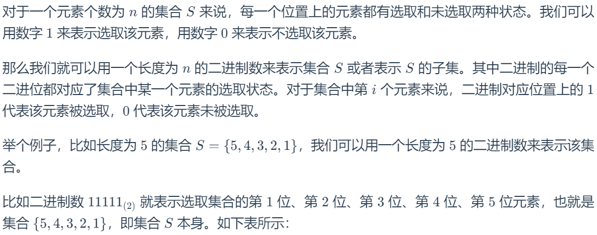


#### 36.线段树

1.常用的用来维护 **区间信息** 的数据结构。

2.可以在$O(log n)$的时间复杂度内实现单点修改、区间修改、区间查询（区间求和，求区间最大值，求区间最小值)等操作。

**线段树的基本结构与建树**

线段树将每个长度不为 1 的区间划分成左右两个区间递归求解，把整个线段划分为一个树形结构，通过合并左右两区间信息来求得该区间的信息。这种数据结构可以方便的进行大部分的区间操作。

有个大小为 $5$ 的数组 a={10,11,12,13,14}，要将其转化为线段树，有以下做法：设线段树的根节点编号为 $1$，用数组 $d$ 来保存我们的线段树，$d_i$ 用来保存线段树上编号为 $i$ 的节点的值（这里每个节点所维护的值就是这个节点所表示的区间总和)。

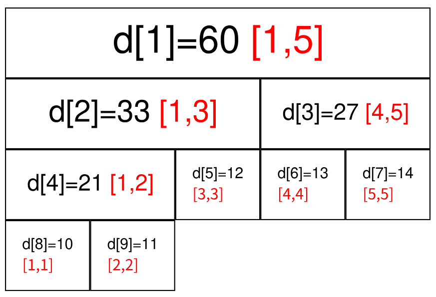

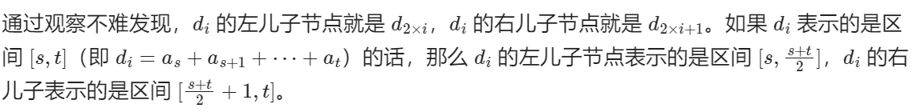

```c++
void build(int s, int t, int p) {
  // 对 [s,t] 区间建立线段树,当前根的编号为 p
  if (s == t) {
    d[p] = a[s];
    return;
  }
  int m = s + ((t - s) >> 1);
  // 移位运算符的优先级小于加减法，所以加上括号
  // 如果写成 (s + t) >> 1 可能会超出 int 范围
  build(s, m, p * 2), build(m + 1, t, p * 2 + 1);
  // 递归对左右区间建树
  d[p] = d[p * 2] + d[(p * 2) + 1];
}
```

**线段树的区间查询**


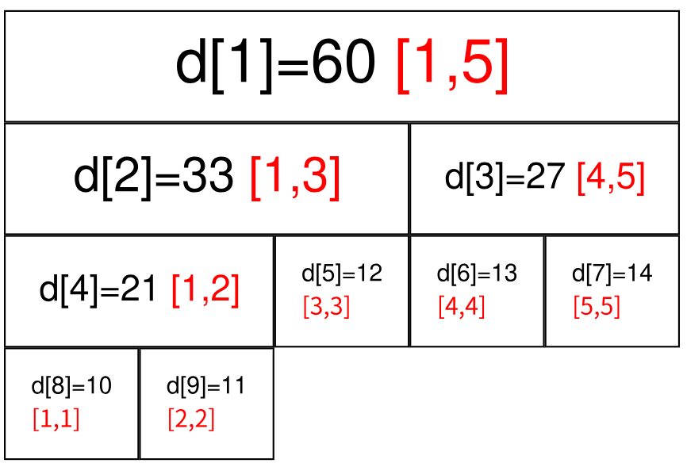

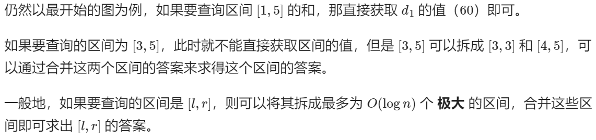

```c++
int getsum(int l, int r, int s, int t, int p) {
  // [l, r] 为查询区间, [s, t] 为当前节点包含的区间, p 为当前节点的编号
  if (l <= s && t <= r)
    return d[p];  // 当前区间为询问区间的子集时直接返回当前区间的和
  int m = s + ((t - s) >> 1), sum = 0;
  if (l <= m) sum += getsum(l, r, s, m, p * 2);
  // 如果左儿子代表的区间 [s, m] 与询问区间有交集, 则递归查询左儿子
  if (r > m) sum += getsum(l, r, m + 1, t, p * 2 + 1);
  // 如果右儿子代表的区间 [m + 1, t] 与询问区间有交集, 则递归查询右儿子
  return sum;
}
```

**线段树的区间修改与懒惰标记**

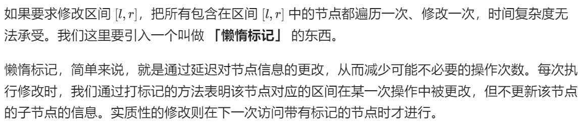

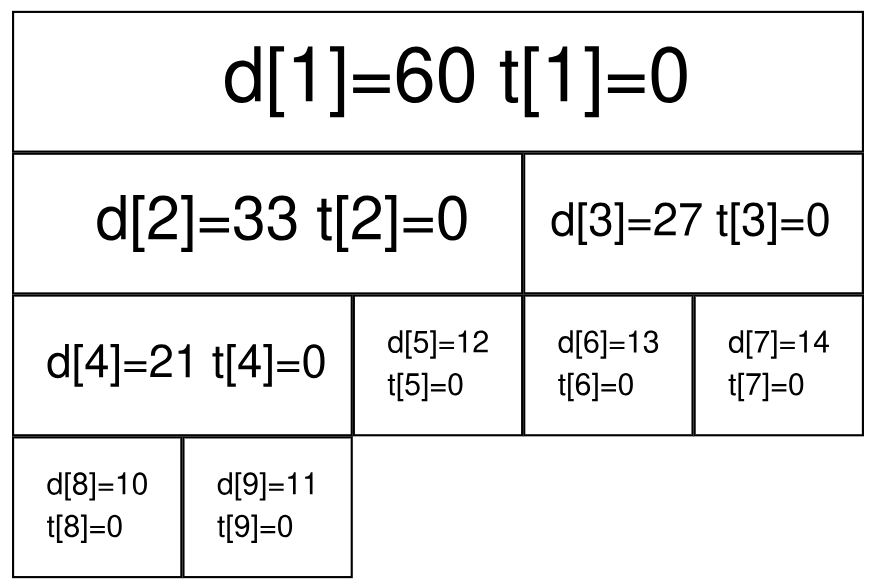

```C++
//区间内加上某个数
void update(int l, int r, int c, int s, int t, int p) {
  // [l, r] 为修改区间, c 为被修改的元素的变化量, [s, t] 为当前节点包含的区间, p
  // 为当前节点的编号
  if (l <= s && t <= r) {
    d[p] += (t - s + 1) * c, b[p] += c;
    return;
  }  // 当前区间为修改区间的子集时直接修改当前节点的值,然后打标记,结束修改
  int m = s + ((t - s) >> 1);
  if (b[p] && s != t) {
    // 如果当前节点的懒标记非空,则更新当前节点两个子节点的值和懒标记值
    d[p * 2] += b[p] * (m - s + 1), d[p * 2 + 1] += b[p] * (t - m);
    b[p * 2] += b[p], b[p * 2 + 1] += b[p];  // 将标记下传给子节点
    b[p] = 0;                                // 清空当前节点的标记
  }
  if (l <= m) update(l, r, c, s, m, p * 2);
  if (r > m) update(l, r, c, m + 1, t, p * 2 + 1);
  d[p] = d[p * 2] + d[p * 2 + 1];
}

//求区间的总和
int getsum(int l, int r, int s, int t, int p) {
  // [l, r] 为查询区间, [s, t] 为当前节点包含的区间, p 为当前节点的编号
  if (l <= s && t <= r) return d[p];
  // 当前区间为询问区间的子集时直接返回当前区间的和
  int m = s + ((t - s) >> 1);
  if (b[p]) {
    // 如果当前节点的懒标记非空,则更新当前节点两个子节点的值和懒标记值
    d[p * 2] += b[p] * (m - s + 1), d[p * 2 + 1] += b[p] * (t - m);
    b[p * 2] += b[p], b[p * 2 + 1] += b[p];  // 将标记下传给子节点
    b[p] = 0;                                // 清空当前节点的标记
  }
  int sum = 0;
  if (l <= m) sum = getsum(l, r, s, m, p * 2);
  if (r > m) sum += getsum(l, r, m + 1, t, p * 2 + 1);
  return sum;
}
```

**常见题型：**

1.**RMQ 问题**：Range Maximum / Minimum Query 的缩写，指的是对于长度为 𝑛 的数组序列 𝑛𝑢𝑚𝑠，回答若干个询问问题 `RMQ(nums, q_left, q_right)`，要求返回数组序列 𝑛𝑢𝑚𝑠 在区间 [𝑞_𝑙𝑒𝑓𝑡,𝑞_𝑟𝑖𝑔ℎ𝑡] 中的最大（最小）值。也就是求区间最大（最小）值问题。

2.单点更新，区间查询问题

3.区间更新，区间查询问题

4.区间合并，区间查询问题

5.扫描线问题：虚拟扫描线或扫描面来解决欧几里德空间中的各种问题，一般被用来解决图形面积，周长等问题。

#### 37.**双栈解决「通用表达式」问题的通用解法**

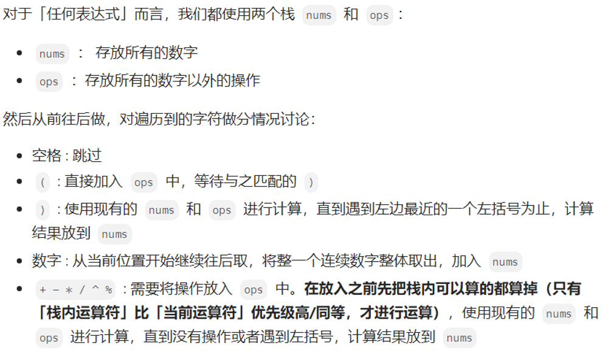

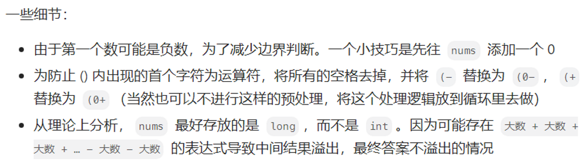

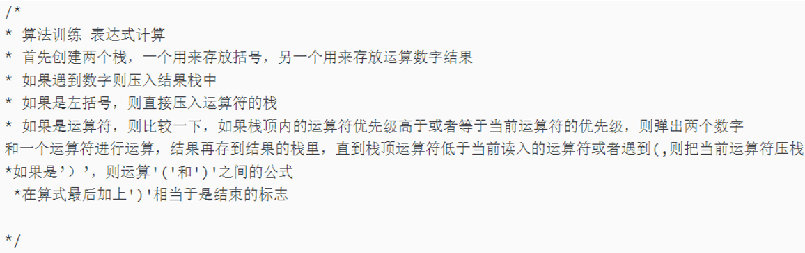

#### 38.OJ在线编程常见输入输出练习

[OJ在线编程常见输入输出练习](https://www.nowcoder.com/exam/test/79196657/detail?pid=27976983#question)
